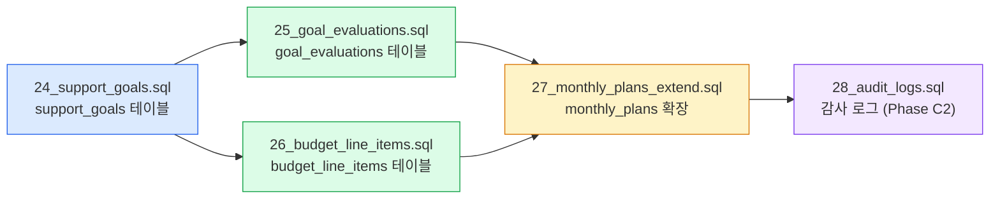
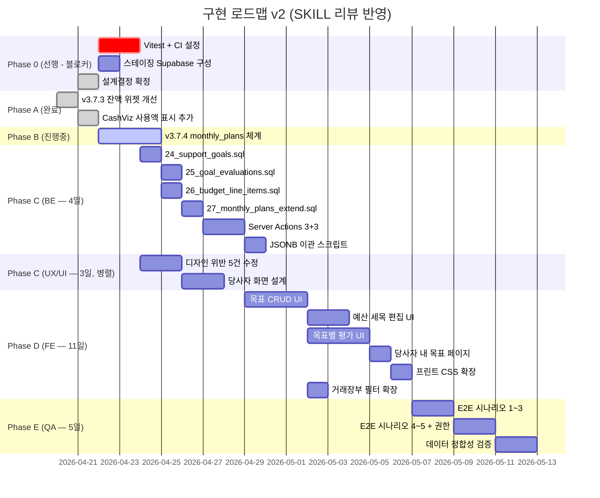
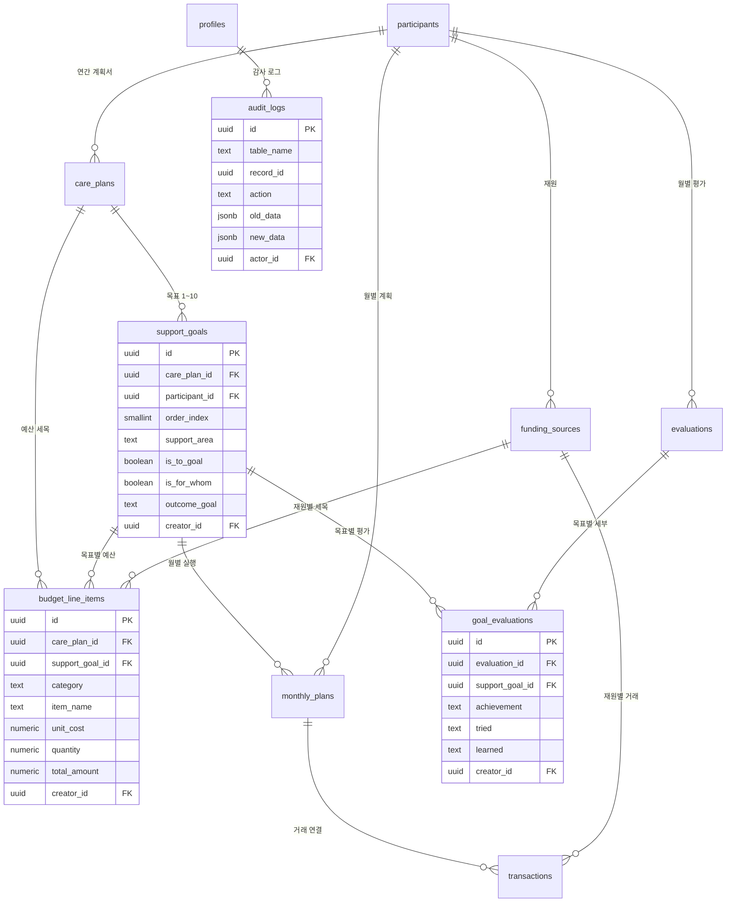

# 계획·평가·예산 데이터 구조 설계 제안서 (v2 — SKILL 리뷰 반영)

> **대상 시스템**: 중랑구청 개인예산 관리 앱 (Personal Budgets App)
> **근거 문서**: [000 개별지원계획서.md](file:///root/workspace/my-project/Personal_Budgets_App/Plan&Source/000%20개별지원계획서.md)
> **작성일**: 2026-04-21 / **개정**: v2 (SKILL 기반 에이전트 팀 리뷰 반영)
> **최종 점검**: 2026-04-21 (Critical 이슈 수정 완료)
> **목적**: Claude Code 에이전트 팀 (PM, BE, FE, PL, QA, UX/UI, DevOps) 에게 전달할 통합 설계 문서

---

## 진행 현황 (2026-04-24 기준)

| Phase | 내용 | 상태 | 커밋 |
|:---:|:---|:---:|:---|
| A | v3.7.3 잔액 위젯 개선 (피자/물컵 중앙 금액, pending 점선) | ✅ 완료 | `a9d741f` |
| A | CashViz 지폐 간격 확대 + "이미 쓴 돈" 섹션 가시성 강화 | ✅ 완료 | `e81c78a` |
| B | v3.7.4 monthly_plans 체계 (migration 23 + CRUD + 위젯 연동) | ✅ 완료 | `27ca29e` |
| 0 | Vitest + @testing-library 설치 + CI `npm test` 추가 | ✅ 완료 | `cea7d51` |
| 0 | 스테이징 Supabase 환경 구성 | ⚠️ 수동 필요 | — |
| C | Migration 24~27 SQL 생성 (support_goals, goal_evaluations, budget_line_items, monthly_plans 확장) | ✅ 완료 | `3c9632d` |
| C | Server Actions 3개 (supportGoal, goalEvaluation, budgetLineItem) | ✅ 완료 | `3c9632d` |
| C | FE 컴포넌트 (SupportGoalsForm, BudgetLineItemsTable, GoalEvaluationCards) | ✅ 완료 | `b2ceb98` |
| C | 당사자 `/my-plan` 읽기 전용 + monthly_plans support_goal 드롭다운 | ✅ 완료 | `d628b7a` |
| F-0 | `src/utils/date.ts` 생성 (KST 타임존 버그 근본 해결) | ✅ 완료 | `3b12876` |
| F-1 | 평가 목록 진입 시 첫 당사자 자동 이동 (useEffect) | ✅ 완료 | `3b12876` |
| F-2 | 평가 페이지 월 선택 P0 버그 수정 (toISOString → 순수 문자열 파싱) | ✅ 완료 | `3b12876` |
| F-3 | 평가 페이지 좌측 활동 요약 → 계획별 거래 그룹 표시 | ✅ 완료 | `3b12876` |
| F-4 | MonthlyPlanProgressTable "연결 목표" 컬럼 추가 | ✅ 완료 | `3b12876` |
| F-6 | 활동 지도 전용 페이지 분리 (`/supporter/map`) + 사이드바 메뉴 추가 | ✅ 완료 | `bd8e318` |
| F-7 | 당사자 통합 대시보드 (`/supporter/participants`, `/supporter/participants/[id]`) | ✅ 완료 | `bd8e318` |
| G-1 | Migration 29 (`care_plans`, `evaluations` 인덱스) — DB 수동 실행 완료 | ✅ 완료 | `bd8e318` |
| G-2 | 월별계획 저장 후 뒤로가기 404 버그 수정 (revalidatePath 캐시키 불일치) | ✅ 완료 | `3b12876` |
| G-3 | 전월 복사 기능 (`copyPlan.ts` + 월별계획 "전월 복사" 버튼 + 평가 "전월 내용 불러오기") | ✅ 완료 | `3b12876` |
| G-4 | 이용계획서 섹션에 "지원목표·예산 계획" 카드 추가 (`CarePlanSection.tsx`) | ✅ 완료 | `3b12876` |
| 버그 | 지원목표 페이지 뒤로가기 404 수정 (존재하지 않는 라우트 → `/supporter/evaluations`) | ✅ 완료 | `8c4926b` |
| 버그 | 활동 지도 필터 복원 (당사자·날짜·상태 필터 + 클라이언트 사이드 필터링) | ✅ 완료 | `6a3e07e` |
| H-사전 | 쉬운 정보 접근성 사전 수정 (BLOCK_METADATA 한자어, 수동태, 외래어, 특수문자, 괄호) | ✅ 완료 | — |
| H-1,4,5 | Wave 1: × 제거, 헤더 한글화, 요약 바 확대 | ✅ 완료 | — |
| H-10,12,13 | Wave 0+1: 버튼 색상 초록/빨강 통일, 잔액 이펙트 수정, 신호등 테마 | ✅ 완료 | — |
| H-2,3,9 | Wave 2: "이미 쓴 돈" 접기, 시뮬레이션 접기, FAB/도움말 숨김 | ✅ 완료 | — |
| H-6~8,11 | Wave 3+4: 프리셋 버튼, ▲▼, 지폐 일러스트, 적응형 UI | ✅ 완료 | — |
| v4.9 | 사진 버튼 + FAB 통합, 꾸미기 저장 버튼 헤더 고정, 접근성 토글 꾸미기 시트 추가, 다크↔노란배경 상호배제 버그 수정, CSV 안내 경로 수정, 닫기 버튼 가시성 개선 | ✅ 완료 | `3f7fb12` |
| I | 당사자 화면 "이번 달 할 것들" + "내가 이루고 싶은 것" 통합 레이아웃 + AI 쉬운 요약 (Migration 30, openai.ts 추출, easyReadSummary.ts, MonthlyPlanEasyCard, SupportGoalEasyCard) | 🔜 예정 | — |

> [!NOTE]
> **v2 최종 점검 수정 사항 (2026-04-21)**
> - `creator_id NOT NULL ... ON DELETE SET NULL` 모순 → **`ON DELETE RESTRICT`** 3곳 수정
> - 나머지 Medium/Low 이슈(audit_logs RLS, evaluations 구조, care_plans_backup)는 Phase C BE 착수 시 반영

> [!NOTE]
> **Phase F/G 완료 요약 (2026-04-22)**
> - KST 타임존 버그 전수 수정 → `src/utils/date.ts` 중앙화
> - 전월 복사 기능: 월별계획(순서 충돌 skip) + 평가 텍스트(key prop으로 폼 remount)
> - 지도 필터: 당사자·날짜·상태 클라이언트 사이드 필터링
> - 이용계획서 화면에서 지원목표·예산 직접 관리 가능 (기존 evaluations/goals 페이지 연결)

> [!NOTE]
> **Phase H 완료 및 추가 피드백 요약 (2026-04-23)**
> - 당사자(발달장애인) 친화적인 "쉬운 정보" 접근성 13개 항목 전면 적용 완료
> - **시각/레이아웃**: 신호등 컬러 테마(초록/노랑/빨강) 적용, 지폐 SVG 일러스트 도입, 적응형 1뷰포트 UI(max-w-2xl) 적용
> - **인지/텍스트**: 곱셈 기호(`×`) 제거 및 "1 장" 단위 표시, 헤더/전문 용어 완전 한글화
> - **인터랙션/사용성**:
>   - "이미 쓴 돈", "시뮬레이션", "이번 달 계획 진행" 영역 기본 접기(토글형)로 정보 과부하 방지
>   - 시뮬레이션 프리셋 버튼(1만/3만/5만원)에 실제 지폐 모티브 컬러 적용 (1만:초록, 5만:노랑, 3만:파랑)
>   - 화면 꾸미기 순서 변경 방식을 당사자 피드백에 따라 원상복구 (▲▼ 화살표 → 줄무늬 드래그 앤 드롭 롤백 및 END 인디케이터 복원)
>   - 하단에 떠다니던 궁금한 점(FAQ) 및 도움말 버튼을 화면 상단 헤더의 '⚙️ 꾸미기' 버튼 옆으로 묶어 배치하고 글씨 크기 확대(`text-xs`)
>   - 잔액 요약 위젯의 보기 방식(피자/물컵/현금 등) 5개 버튼을 가로 공간 절약을 위해 네이티브 드롭다운(`<select>`)으로 변경
>   - 부드러운 잔액 애니메이션(easeOutCubic) 도입

---

## 0. v1 → v2 주요 변경 이력

> [!IMPORTANT]
> SKILL 기반 에이전트 팀 리뷰 결과 반영

| # | 변경 항목 | 변경 전 (v1) | 변경 후 (v2) | 근거 |
|:---:|:---|:---|:---|:---|
| 1 | `life_balance` 필드 | 단일 TEXT | `is_to_goal` BOOLEAN + `is_for_whom` BOOLEAN 분리 | BE: 정의 불명확 |
| 2 | `goal_evaluations.creator_id` | 선택적 FK | **NOT NULL** + Server Action에서 강제 설정 | BE: 사용자 조작 방지 |
| 3 | `budget_line_items.support_goal_id` ON DELETE | SET NULL | **RESTRICT** | BE: 세목 손실 방지 |
| 4 | §9 설계결정 1~3 | "팀 논의 필요" | **확정** (PL 최종 판단) | PL 조건부 승인 |
| 5 | §9.4 활동사진 연결 | "자동 추론 B" | **초기 A(수동), 2차에서 B** | PL 판단 |
| 6 | Migration 실행 순서 | "24→25→26→27 문서화" | **24 → {25+26 병렬} → 27** FK 강제 | PL+BE |
| 7 | QA 일정 | 3일 | **5일** (5시나리오 × 3권한) | PM |
| 8 | Vitest/Playwright | 미언급 | **Phase 0 선행 필수** | QA 블로커 |
| 9 | 감사 로그 | 미언급 | **audit_log 테이블 추가** (Phase C2) | PM 컴플라이언스 |
| 10 | UX 디자인 위반 | 미언급 | **5건 수정 체크리스트** 명시 | UX/UI |
| 11 | 전체 공수 | 미산정 | **~35 인일** | PM |
| 12 | 스테이징 환경 | 미언급 | **Phase 0 구성 필수** | DevOps |

---

## 1. 현황 분석

*(v1과 동일 — §1.1~§1.3 생략, [v1 제안서](file:///root/.gemini/antigravity/brain/20c139b1-11aa-4308-8ea0-107337ba4bf7/plan_evaluation_budget_proposal.md) 참조)*

---

## 2. 확정된 설계 결정 (PL 최종 판단)

> [!CAUTION]
> 아래 7개 항목은 PL 승인 완료. 추가 논의 없이 구현 착수한다.

| # | 항목 | 최종 결정 | 비고 |
|:---:|:---|:---:|:---|
| 1 | care_plans JSONB → support_goals 이관 | **✅ B: 완전 이관** | 이중 소스 유지 시 API 복잡도 급증 |
| 2 | budget_line_items.total_amount | **✅ B: GENERATED ALWAYS** | Supabase PG15+ 지원 확인됨 |
| 3 | 평가 워크플로우 | **✅ B: 동시 저장** | 트랜잭션 처리 필수 |
| 4 | 활동사진 ↔ 목표 연결 | **⚠️ 초기 A(수동)** | 2차에서 자동 추론(B) 도입 |
| 5 | 계획 없는 지출 nullable | **✅ B 유지** | monthly_plan_id NULL 허용 |
| 6 | 연간 목표 최대 | **✅ B: 10개** | 확장성 확보 |
| 7 | 지원 영역 코드화 | **✅ 초기 A(자유 텍스트)** | v4.0에서 enum 도입 |

---

## 3. 제안 데이터 모델 (v2 수정)

### 3.1 `support_goals` — 연간 지원 목표 (BE 수정 반영)

```sql
CREATE TABLE public.support_goals (
  id              UUID PRIMARY KEY DEFAULT gen_random_uuid(),
  care_plan_id    UUID NOT NULL REFERENCES care_plans(id) ON DELETE CASCADE,
  participant_id  UUID NOT NULL REFERENCES participants(id) ON DELETE CASCADE,
  order_index     SMALLINT NOT NULL CHECK (order_index BETWEEN 1 AND 10),
  
  -- §4 컬럼 매핑
  support_area    TEXT NOT NULL,                -- "고용 활동", "평생학습 활동" 등
  -- ✏️ v2: life_balance → 분리 (BE 피드백)
  is_to_goal      BOOLEAN DEFAULT FALSE,       -- 당사자에게 중요한 것 (To)
  is_for_whom     BOOLEAN DEFAULT FALSE,       -- 당사자를 위해 중요한 것 (For)
  needed_support  TEXT,                        -- "필요한 지원"
  outcome_goal    TEXT,                        -- "성과 및 산출 목표"
  strategy        TEXT,                        -- "전략계획(누가, 언제, 어떻게)"
  linked_services TEXT,                        -- "연계 가능한 지원"
  
  -- §6 평가 도구 참조
  eval_tool       TEXT,                        -- 평가 도구 설명
  eval_target     TEXT,                        -- 목표치
  
  is_active       BOOLEAN DEFAULT TRUE,
  -- ✏️ v2: creator_id NOT NULL (BE 피드백) / RESTRICT — 실무자 계정 삭제 방지
  creator_id      UUID NOT NULL REFERENCES profiles(id) ON DELETE RESTRICT,
  created_at      TIMESTAMPTZ DEFAULT NOW(),
  updated_at      TIMESTAMPTZ DEFAULT NOW(),
  
  UNIQUE (care_plan_id, order_index)
);
```

> [!NOTE]
> **v2 변경점**:
> - `life_balance TEXT` → `is_to_goal BOOLEAN` + `is_for_whom BOOLEAN` (명확한 의미 부여)
> - `creator_id` NOT NULL 강제 (Server Action에서 `auth.uid()` 자동 주입)

---

### 3.2 `goal_evaluations` — 목표별 평가 (BE 수정 반영)

```sql
CREATE TABLE public.goal_evaluations (
  id              UUID PRIMARY KEY DEFAULT gen_random_uuid(),
  evaluation_id   UUID NOT NULL REFERENCES evaluations(id) ON DELETE CASCADE,
  support_goal_id UUID NOT NULL REFERENCES support_goals(id) ON DELETE CASCADE,
  
  -- 4+1 평가 프레임워크
  tried           TEXT,
  achievement     TEXT CHECK (achievement IN ('achieved', 'in_progress', 'not_achieved')),
  learned         TEXT,
  satisfied       TEXT,
  dissatisfied    TEXT,
  next_plan       TEXT,
  
  -- 정량 메트릭 (선택)
  target_value    NUMERIC,
  actual_value    NUMERIC,
  
  -- ✏️ v2: creator_id NOT NULL (BE 피드백) / RESTRICT — 실무자 계정 삭제 방지
  creator_id      UUID NOT NULL REFERENCES profiles(id) ON DELETE RESTRICT,
  created_at      TIMESTAMPTZ DEFAULT NOW(),
  updated_at      TIMESTAMPTZ DEFAULT NOW(),
  
  UNIQUE (evaluation_id, support_goal_id)
);
```

---

### 3.3 `budget_line_items` — 예산 세목 (BE 수정 반영)

```sql
CREATE TABLE public.budget_line_items (
  id                UUID PRIMARY KEY DEFAULT gen_random_uuid(),
  care_plan_id      UUID NOT NULL REFERENCES care_plans(id) ON DELETE CASCADE,
  funding_source_id UUID REFERENCES funding_sources(id) ON DELETE SET NULL,
  -- ✏️ v2: ON DELETE RESTRICT (BE 피드백 — 세목 및 집행 데이터 보호)
  support_goal_id   UUID REFERENCES support_goals(id) ON DELETE RESTRICT,
  
  category          TEXT NOT NULL,
  item_name         TEXT NOT NULL,
  
  unit_cost         NUMERIC NOT NULL DEFAULT 0,
  quantity          NUMERIC NOT NULL DEFAULT 1,
  unit_label        TEXT,
  calculation_note  TEXT,
  total_amount      NUMERIC GENERATED ALWAYS AS (unit_cost * quantity) STORED,
  
  order_index       SMALLINT DEFAULT 1,
  -- RESTRICT — 실무자 계정 삭제 방지
  creator_id        UUID NOT NULL REFERENCES profiles(id) ON DELETE RESTRICT,
  created_at        TIMESTAMPTZ DEFAULT NOW(),
  updated_at        TIMESTAMPTZ DEFAULT NOW()
);
```

---

### 3.4 `monthly_plans` 확장 (v1과 동일)

```sql
ALTER TABLE public.monthly_plans
  ADD COLUMN IF NOT EXISTS support_goal_id UUID REFERENCES support_goals(id) ON DELETE SET NULL;

ALTER TABLE public.monthly_plans
  ADD COLUMN IF NOT EXISTS activity_photos TEXT[] DEFAULT '{}';

ALTER TABLE public.monthly_plans
  ADD COLUMN IF NOT EXISTS staff_notes TEXT;

CREATE INDEX IF NOT EXISTS idx_monthly_plans_support_goal
  ON public.monthly_plans (support_goal_id);
```

---

### 3.5 (신규) `audit_logs` — 감사 로그 (PM 컴플라이언스)

> [!WARNING]
> 개별지원계획서는 법적 구속력이 있으며, 수정 이력 추적이 필요합니다.

```sql
CREATE TABLE public.audit_logs (
  id          UUID PRIMARY KEY DEFAULT gen_random_uuid(),
  table_name  TEXT NOT NULL,                                   -- 'support_goals', 'budget_line_items' 등
  record_id   UUID NOT NULL,                                   -- 대상 레코드 ID
  action      TEXT NOT NULL CHECK (action IN ('insert', 'update', 'delete')),
  old_data    JSONB,                                           -- 변경 전 데이터
  new_data    JSONB,                                           -- 변경 후 데이터
  actor_id    UUID NOT NULL REFERENCES profiles(id),           -- 변경 수행자
  created_at  TIMESTAMPTZ DEFAULT NOW()
);

CREATE INDEX IF NOT EXISTS idx_audit_logs_table_record
  ON public.audit_logs (table_name, record_id);
CREATE INDEX IF NOT EXISTS idx_audit_logs_actor
  ON public.audit_logs (actor_id);
```

> [!TIP]
> Phase C2 에서 도입. 초기엔 Server Action 레벨에서 INSERT만 수행(트리거 미사용). 
> 향후 PG 트리거로 자동화 가능.

---

## 4. Migration 실행 순서 (PL+BE+DevOps 합의)



> [!CAUTION]
> **순서 강제**: 24가 먼저 실행되어야 25/26의 FK 참조 가능. 25+26은 병렬 가능. 27은 24 이후.

---

## 5. 에이전트 팀별 작업 범위 (v2 — 공수 반영)

### 5.0 Phase 0: 선행 작업 (착수 전 필수) — 2.5일

> [!CAUTION]
> 아래 3건이 해결되지 않으면 Phase C 착수 불가 (QA+DevOps 블로커)

| # | 작업 | 담당 | 공수 | 상태 |
|:---:|:---|:---:|:---:|:---:|
| 0-1 | §9 설계결정 1~3 확정 | 전체 | 0.5일 | ✅ v2에서 확정 |
| 0-2 | Vitest + Playwright 설치 + CI `npm test` 추가 | DevOps | 1.5일 | ✅ Vitest 완료 (Playwright 미완) |
| 0-3 | 스테이징 Supabase 환경 구성 | DevOps | 0.5일 | ❌ 미완 |

---

### 5.1 PM — 1일

- [x] ~~§9 설계결정 1~3 확정~~ (v2에서 확정)
- [ ] QA Phase E 일정 4~5일로 재조정 (5 시나리오 × 3 권한)
- [ ] "목표 없는 지출"의 보고서 상 처리 방식 명확화
  - monthly_plan_id NULL 거래 → 보고서에 "기타 / 계획 외" 섹션으로 분류
- [ ] 감사 로그(audit_log) 컴플라이언스 계획 수립

---

### 5.2 BE — 4일 (3~4일 → 4일 확정)

- [ ] Migration SQL 4건 생성 (§4 참조)
  - `24_support_goals.sql` — `is_to_goal` / `is_for_whom` BOOLEAN 분리
  - `25_goal_evaluations.sql` — `creator_id NOT NULL`
  - `26_budget_line_items.sql` — `support_goal_id ON DELETE RESTRICT`
  - `27_monthly_plans_extend.sql`
- [ ] RLS 정책 (기존 23번 패턴 복제)
- [ ] `set_updated_at()` 트리거 4개 테이블 연결
- [ ] Server Actions 신규 3개 + 수정 3개
  - **모든 Action에서 `creator_id = auth.uid()` 강제 설정**
- [ ] care_plans JSONB → support_goals 이관 스크립트
- [ ] `npm run generate-types` 재생성

---

### 5.3 FE — 11일

#### RSC vs Client 분류 (v2 추가)

| 컴포넌트 | 형태 | 이유 |
|:---|:---:|:---|
| `SupportGoalsForm` | `'use client'` | 폼 상태 관리 |
| `BudgetLineItemsTable` | `'use client'` | 인라인 계산기 실시간 반응 |
| `GoalEvaluationCards` | `'use client'` | 4+1 탭/아코디언 인터랙션 |
| `/my-plan` 당사자 목표 | **RSC** | 서버에서 권한 검증 + 조회만 |
| `MonthlyPlanMiniProgress` | `'use client'` | 기존 유지 |

#### 작업 목록

- [ ] `SupportGoalsForm` — 목표 CRUD (3일)
- [ ] `BudgetLineItemsTable` — 산출내역 편집 + 인라인 계산기 (2일)
- [ ] `GoalEvaluationCards` — 4+1 평가 카드 (3일)
- [ ] monthly_plans 편집에 `support_goal` 드롭다운 (0.5일)
- [ ] 거래장부 `support_goal` 간접 필터 (0.5일)
- [ ] 당사자 `/my-plan` 읽기 전용 (1일)
- [ ] 프린트 CSS 확장 (1일)

---

### 5.4 UX/UI — 3일 (v2 추가 — 디자인 시스템 위반 5건 수정)

> [!WARNING]
> UX/UI 리뷰에서 발견된 5건의 디자인 시스템 위반을 반드시 수정해야 합니다.

| # | 위반 사항 | 수정 방향 | 우선순위 |
|:---:|:---|:---|:---:|
| 1 | 예산 계산기 +−×÷ 아이콘 단독 사용 | **텍스트 레이블 필수** ("추가", "삭제", "곱하기") | P0 |
| 2 | 삭제 확인 모달 미명시 | **"정말 삭제하시겠어요? 되돌릴 수 없어요."** 확인 모달 필수 | P0 |
| 3 | 평가 체크박스 색상 대비 미검증 | 달성(초록)/진행중(파랑)/미달성(회색) + **색맹 고려 아이콘 병행** (✓/▶/—) | P1 |
| 4 | 보조 텍스트 12sp → 14sp | 최소 **14sp** 상향 | P1 |
| 5 | 줄 간격 1.3배 → 1.6배 | **line-height: 1.6** 전역 통일 | P1 |

#### 당사자 화면 우선순위 (UX/UI 확정)

| 우선순위 | 화면 | 핵심 규격 |
|:---:|:---|:---|
| 상 | 내 목표 읽기 전용 | 이모지 32px + **24sp Bold** + 진행바 |
| 중 | 활동 사진 업로드 | 3장 제한, **48px 터치 영역** |
| 하 | 자기결정 권리 평가 시각화 | 후속 |

> [!TIP]
> 신규 3개 화면 모두 **카드 기반 수직 레이아웃** 통일 → 인지 부하 50% 감소 (UX/UI 권장)

---

### 5.5 QA — 5일 (v1의 3일 → v2 5일)

#### 🔴 P0 블로커 (배포 불가)

| # | 블로커 | 해결 방법 | 공수 |
|:---:|:---|:---|:---:|
| Q1 | Vitest/Playwright 미설치 | Phase 0에서 설치 + CI `npm run test` 추가 | 1.5일 |
| Q2 | Migration 24~27 SQL 미생성 | BE가 Phase C에서 생성 | — |
| Q3 | 이관 스크립트 미작성 | BE가 care_plans JSONB → support_goals 스크립트 작성 | — |

#### E2E 테스트 시나리오 (5 × 3 권한)

| # | 시나리오 | admin | supporter | participant |
|:---:|:---|:---:|:---:|:---:|
| 1 | 계획서 → 목표 5개 → 세목 등록 | ✅ CRUD | ✅ CRUD | ❌ 리다이렉트 |
| 2 | 월별 계획 → 목표 매핑 → 거래 | ✅ | ✅ | 🔒 읽기전용 |
| 3 | 월별 평가 → 목표별 4+1 → AI | ✅ | ✅ | ❌ 리다이렉트 |
| 4 | 홈 위젯 목표 진행률 | ✅ | ✅ | ✅ 읽기전용 |
| 5 | 권한 우회 접근 차단 | ✅ | ✅ | ✅ 검증 | 

#### 데이터 정합성 자동 검증 쿼리 (v2 추가)

```sql
-- 1. 예산 합계 불일치 감지
SELECT c.id, fs.id, SUM(bli.total_amount) AS line_total, fs.yearly_budget
FROM care_plans c
LEFT JOIN budget_line_items bli ON c.id = bli.care_plan_id
LEFT JOIN funding_sources fs ON bli.funding_source_id = fs.id
GROUP BY c.id, fs.id
HAVING SUM(bli.total_amount) <> fs.yearly_budget;

-- 2. Orphan 목표 평가 (부모 목표 삭제된 평가)
SELECT ge.id FROM goal_evaluations ge
WHERE NOT EXISTS (SELECT 1 FROM support_goals sg WHERE sg.id = ge.support_goal_id);

-- 3. NULL monthly_plan 거래 모니터링 (계획 외 지출)
SELECT COUNT(*) AS unplanned_tx_count 
FROM transactions 
WHERE monthly_plan_id IS NULL AND date >= DATE_TRUNC('month', CURRENT_DATE);

-- 4. care_plans JSONB 이관 검증 (이관 후)
SELECT cp.id, cp.plan_year,
  (cp.content->>'service_plan' IS NOT NULL) AS has_legacy_goals,
  COUNT(sg.id) AS migrated_goals
FROM care_plans cp
LEFT JOIN support_goals sg ON sg.care_plan_id = cp.id
GROUP BY cp.id, cp.plan_year
HAVING (cp.content->>'service_plan' IS NOT NULL) AND COUNT(sg.id) = 0;
```

---

### 5.6 DevOps — 4일

#### 🔴 블로커 해결 (Phase 0)

| # | 블로커 | 해결 | 공수 |
|:---:|:---|:---|:---:|
| D1 | Vitest 미포함 | `npm i -D vitest @testing-library/react` + CI 스텝 | 1일 |
| D2 | 스테이징 Supabase 없음 | 무료 프로젝트 생성 + `.env.staging` | 0.5일 |
| D3 | CI 테스트 스텝 없음 | GitHub Actions에 `npm run test --run` 추가 | 0.5일 |

#### 롤백 계획 (v2 추가)

| Migration | 롤백 방법 | 데이터 손실 위험 |
|:---|:---|:---:|
| 24 (support_goals) | `DROP TABLE support_goals CASCADE` | ⚠️ 목표 데이터 |
| 25 (goal_evaluations) | `DROP TABLE goal_evaluations CASCADE` | ⚠️ 평가 데이터 |
| 26 (budget_line_items) | `DROP TABLE budget_line_items CASCADE` | ⚠️ 세목 데이터 |
| 27 (monthly_plans 확장) | `ALTER TABLE DROP COLUMN` × 3 | LOW |

> [!CAUTION]
> 배포 전 Supabase 수동 스냅샷 필수 (무료 티어 주 1회).
> RLS 정책 변경은 **반드시 스테이징에서 먼저 검증**.

---

## 6. 공수 총괄 (v2 재산정)

| Phase | 역할 | 공수 | 의존성 |
|:---:|:---|:---:|:---|
| 0 | DevOps | 2.5일 | — (선행) |
| C | BE | 4일 | Phase 0 완료 |
| C | FE (병렬) | 11일 | BE Migration + Actions 완료 후 |
| C | UX/UI (병렬) | 3일 | 독립 |
| E | QA | 5일 | FE 완료 후 |
| — | PM (지속) | 1일 | 전 구간 |
| | **총합** | **~35 인일** | |



---

## 7. "목표 없는 지출" 보고서 처리 (PM 요청 — v2 추가)

`transactions.monthly_plan_id = NULL` 인 거래의 보고서 처리:

| 필드 | 표시 방식 |
|:---|:---|
| 계획명 | "기타 / 계획 외 지출" |
| 목표 영역 | "미지정" |
| 예산 집행률 | — (별도 집계 제외, 총액에만 포함) |
| 필터 | 거래장부 "계획" 필터에서 "계획 없음" 옵션으로 노출 |
| 프린트 | 예산 집행 내역표 하단 "기타 지출" 섹션에 합산 표시 |

---

## 8. 이관 리스크 관리 (QA 경고 반영)

> [!WARNING]
> care_plans JSONB → support_goals 이관 시 `order_index` 손실 가능 → **HIGH** 리스크

### 이관 절차

```
1. [백업] 모든 care_plans 레코드를 별도 테이블에 복사
2. [분석] JSONB content 내 service_plan 배열 파싱 → order_index 자동 부여 (배열 순서)
3. [이관] support_goals INSERT (care_plan_id, participant_id, order_index, ...)
4. [검증] §5.5 정합성 쿼리 4번 실행 — has_legacy_goals=true AND migrated_goals=0 → FAIL
5. [정리] 검증 통과 시 care_plans.content 에서 service_plan 키 제거
6. [확인] 이관 전후 목표 수 비교 보고서 출력
```

### Rollback

```sql
-- 이관 실패 시: support_goals 초기화 + care_plans.content 백업 복원
TRUNCATE support_goals CASCADE;
UPDATE care_plans SET content = backup.content
FROM care_plans_backup backup
WHERE care_plans.id = backup.id;
```

---

## 9. RLS 보안 강화 (PL 요청 — v2 추가)

### monthly_plans.support_goal_id NULL 시 RLS 명시

> [!WARNING]
> `support_goal_id` NULL인 monthly_plans 에서 참여자 권한 우회 가능성

```sql
-- 기존 RLS 보강: 참여자는 반드시 본인 participant_id 일치 확인
CREATE POLICY "monthly_plans_participant_own" ON public.monthly_plans
  FOR SELECT TO authenticated
  USING (
    participant_id = auth.uid()
    OR EXISTS (
      SELECT 1 FROM public.profiles
      WHERE profiles.id = auth.uid()
        AND profiles.role IN ('admin', 'supporter')
    )
  );
```

> [!NOTE]
> support_goal_id가 NULL이어도 participant_id 기준 RLS가 적용되므로 안전.
> 기존 migration 23의 정책과 동일 패턴이나, 명시적으로 재확인.

---

## 10. 기존 자산 재사용 + 신규 패턴

| 자산 | 위치 | 재사용 | v2 추가 사항 |
|:---|:---|:---|:---|
| `formatCurrency` | `budget-visuals.ts` | 전역 | — |
| `EasyTerm` | `EasyTerm.tsx` | 전역 | — |
| RLS 패턴 | `23_monthly_plans.sql` | 4개 테이블 복제 | NULL FK RLS 명시 |
| `set_updated_at()` 트리거 | 기존 | 4개 테이블 연결 | — |
| 집계 쿼리 패턴 | `monthlyPlan.ts` | `getGoalProgress` | budget_line_items JOIN 추가 |
| **삭제 확인 모달** | — | **신규 공통 컴포넌트** 필요 | UX#2 |
| **색맹 아이콘** | — | 체크/진행/미달성 아이콘 세트 | UX#3 |

---

## 부록 A: 전체 ER 다이어그램 (v2 — audit_logs 추가)



---

## 부록 B: 즉시 실행 체크리스트 (착수 전)

- [x] §9 설계결정 1~7 확정 (v2에서 PL 승인)
- [ ] Vitest + @testing-library/react 설치
- [ ] GitHub Actions CI에 `npm run test --run` 스텝 추가
- [ ] 스테이징 Supabase 프로젝트 생성 + `.env.staging`
- [ ] Migration 24~27 SQL 파일 생성 (BE)
- [ ] care_plans JSONB 이관 SQL 스크립트 초안 (BE)
- [ ] UX 위반 5건 디자인 명세 업데이트 (UX/UI)

**위 체크리스트 완료 후 Phase C 정식 착수**

---
---

# Phase F: 월별 평가 UX 개선 + 관리자 화면 재구성 (v3 — 2026-04-22)

> **요청자**: 사용자 (현장 피드백 기반)
> **대상 팀**: Claude Code 에이전트 팀 (PM, BE, FE, PL, QA, UX/UI, DevOps)
> **참조 Skills**: `.claude/skills/` (pm, pl, frontend, backend, qa, ux-ui, devops)
> **구현 참조**: 기존 제안서 v2 §1~부록B 전체

---

## F-0. 요청 사항 요약 및 이슈 분류

| # | 이슈 | 유형 | 심각도 | 영향 페이지 |
|:---:|:---|:---:|:---:|:---|
| F-1 | 평가 페이지 진입 시 기본 당사자 데이터 미표시 (불러오기 버튼 필요) | UX 버그 | 🟡 P1 | `/supporter/evaluations` |
| F-2 | 4월 선택 시 3월 평가 출력 — 계획 월 매칭 오류 | 로직 버그 | 🔴 P0 | `/supporter/evaluations/[participantId]/[month]` |
| F-3 | 거래장부에서 계획 매칭한 거래가 평가 화면에서 확인 안 됨 | 기능 누락 | 🟡 P1 | 평가 상세 + 거래장부 |
| F-4 | 지원 목표 ↔ 월별 계획이 평가에서 짝지어 보이지 않음 | 기능 누락 | 🟡 P1 | 평가 상세 |
| F-5 | 계획별 실행 평가 불가 — 현재 월별 전체 활동 평가만 가능 | 구조 결함 | 🔴 P0 | 평가 상세 + GoalEvaluationCards |
| F-6 | 거래장부 내 지도 기능 → 별도 페이지로 분리 | 구조 개선 | 🟢 P2 | `/supporter/transactions` → `/supporter/map` |
| F-7 | 관리자 당사자별 통합 대시보드 신규 | 신규 기능 | 🟡 P1 | `/supporter/participants/[id]` (신규) |

---

## F-1. 평가 페이지 기본 선택 자동 표시

### 현재 문제
[EvaluationsPageClient.tsx](file:///root/workspace/my-project/Personal_Budgets_App/src/components/evaluations/EvaluationsPageClient.tsx) (line 28~40)

- 첫 번째 당사자 + 이번 달이 `useState`로 기본 선택되지만, **"불러오기" 버튼을 누르기 전까지 평가 내용이 비어 있음**
- 사용자는 페이지 진입 시 바로 평가 내용을 보고 싶어함

### 수정 방향

| 구분 | 변경 |
|:---|:---|
| **FE** | `EvaluationsPageClient`에서 `useEffect`로 초기 로드 시 자동 redirect |
| **방법 A (권장)** | 서버 측에서 첫 번째 당사자+현재 월로 자동 redirect → `evaluations/[participantId]/[month]` 상세 페이지로 즉시 이동 |
| **방법 B** | 클라이언트에서 `useEffect(()=>handleLoad(), [])` 호출 — 깜빡임 발생 가능 |

#### 수정 대상 파일

##### [MODIFY] [evaluations/page.tsx](file:///root/workspace/my-project/Personal_Budgets_App/src/app/(supporter)/supporter/evaluations/page.tsx)

```
// 서버 컴포넌트에서: participant_id 미지정 시 첫 번째 당사자 + 현재 월로 redirect
if (!params.participant_id && participants && participants.length > 0) {
  const now = new Date()
  const currentMonth = `${now.getFullYear()}-${String(now.getMonth()+1).padStart(2,'0')}-01`
  redirect(`/supporter/evaluations/${participants[0].id}/${currentMonth}`)
}
```

- 이렇게 하면 "불러오기" 없이 **진입 즉시** 첫 당사자의 현재 월 평가가 표시
- `EvaluationsPageClient`의 "불러오기" UI는 **"다른 당사자/월 전환"** 용도로 유지

---

## F-2. 계획 월 매칭 오류 (P0)

### 현재 문제
[evaluations/[participantId]/[month]/page.tsx](file:///root/workspace/my-project/Personal_Budgets_App/src/app/(supporter)/supporter/evaluations/%5BparticipantId%5D/%5Bmonth%5D/page.tsx) (line 34~36)

```typescript
const startDate = month  // "2026-04-01"
const nextMonth = new Date(new Date(month).getFullYear(), new Date(month).getMonth() + 1, 1)
```

- `month` 파라미터 형식이 `YYYY-MM-01` (날짜 포함)인데, URL에서 `YYYY-MM` 형식으로 올 수도 있음
- **시간대(timezone) 문제**: `new Date('2026-04')` 는 UTC 기준으로 파싱되어 KST 기준 3월 31일이 될 수 있음

### 수정 방향

| 구분 | 변경 |
|:---|:---|
| **BE/FE** | 월 파라미터 정규화 함수 추가 |
| **핵심** | `new Date()` 대신 **문자열 파싱**으로 시간대 무관 처리 |

#### 수정 코드

```typescript
// utils/date.ts (신규 또는 기존에 추가)
export function normalizeMonth(month: string): { startDate: string; endDate: string; display: string } {
  // "2026-04", "2026-04-01", "2026-4" 모두 처리
  const parts = month.split('-')
  const year = parseInt(parts[0], 10)
  const m = parseInt(parts[1], 10)
  
  const startDate = `${year}-${String(m).padStart(2, '0')}-01`
  const nextYear = m === 12 ? year + 1 : year
  const nextM = m === 12 ? 1 : m + 1
  const endDate = `${nextYear}-${String(nextM).padStart(2, '0')}-01`
  const display = `${year}년 ${m}월`
  
  return { startDate, endDate, display }
}
```

##### [MODIFY] [evaluations/[participantId]/[month]/page.tsx](file:///root/workspace/my-project/Personal_Budgets_App/src/app/(supporter)/supporter/evaluations/%5BparticipantId%5D/%5Bmonth%5D/page.tsx)

```diff
- const startDate = month
- const nextMonth = new Date(new Date(month).getFullYear(), new Date(month).getMonth() + 1, 1)
- const endDate = nextMonth.toISOString().split('T')[0]
+ import { normalizeMonth } from '@/utils/date'
+ const { startDate, endDate, display: displayMonth } = normalizeMonth(month)
```

> [!CAUTION]
> 이것은 **P0 버그**입니다. 4월을 선택했는데 3월 데이터가 나오는 것은 시간대 파싱 이슈일 가능성이 높습니다.

---

## F-3. 거래-계획-평가 간 연계 표시

### 현재 문제
- 거래장부에서 `monthly_plan_id`로 계획에 매칭한 거래가 있지만
- 평가 상세 페이지에서는 **월 기준 전체 거래**만 표시 (활동 요약 섹션, line 155~164)
- 어떤 계획에 연결된 거래인지 구분 안 됨

### 수정 방향

#### [MODIFY] 평가 상세 페이지 — 계획별 거래 그룹핑

`evaluations/[participantId]/[month]/page.tsx` 좌측 "활동 요약" 섹션을:

**Before (현재)**:
```
- 총 지출 금액: 150,000원
- 확정된 활동 건수: 5건
- 주요 활동 내역:
  볼링 10,000원
  댄스 160,000원
  ...
```

**After (개선)**:
```
계획 1: 볼링 활동 (지원목표: 평생학습)
  ├ 04-05 볼링 이용료  10,000원  ✅
  ├ 04-12 볼링 이용료  10,000원  ✅
  └ 소계: 20,000원 / 예산 40,000원 (50%)

계획 2: 댄스 수강 (지원목표: 사회 활동)
  ├ 04-01 댄스수강료  160,000원  ✅
  └ 소계: 160,000원 / 예산 160,000원 (100%)

기타 (계획 외 지출)
  ├ 04-20 간식 구매    5,000원  ✅
  └ 소계: 5,000원
```

#### 구현

```typescript
// 기존 transactions 쿼리에 monthly_plan JOIN 추가
const { data: transactions } = await supabase
  .from('transactions')
  .select('*, monthly_plan:monthly_plans(id, title, order_index, planned_budget, support_goal:support_goals(id, support_area))')
  .eq('participant_id', participantId)
  .gte('date', startDate)
  .lt('date', endDate)
  .eq('status', 'confirmed')

// 그룹핑: monthly_plan_id 기준
const grouped = groupTransactionsByPlan(transactions)
```

##### [NEW] `src/components/evaluations/PlanGroupedTransactions.tsx`

계획별로 그룹핑하여 보여주는 클라이언트 컴포넌트:
- 각 그룹에 계획 제목 + 연결된 지원목표 표시
- 소계 + 예산 대비 진행률 게이지
- `monthly_plan_id = NULL` 거래는 "기타 (계획 외)" 섹션으로 분류

---

## F-4. 지원 목표 ↔ 월별 계획 짝 맞추기

### 현재 문제
- `MonthlyPlanProgressTable`(line 82~83)에 "목표/실제" 컬럼이 있지만 **support_goal 이름이 직접 표시되지 않음**
- 목표별 평가(`GoalEvaluationCards`)와 계획별 진행률이 **분리된 섹션**으로 보여져 연결이 안 느껴짐

### 수정 방향

#### [MODIFY] MonthlyPlanProgressTable — 지원목표 컬럼 추가

```diff
 <thead>
   <tr>
     <th>#</th>
     <th>계획</th>
+    <th>지원 목표</th>
     <th>재원</th>
     <th>예산</th>
     ...
```

- `MonthlyPlanProgress` 타입에 `support_goal?: { id: string; support_area: string }` 추가
- `getMonthlyPlanProgress` 쿼리에 `support_goal:support_goals(id, support_area)` JOIN 추가

#### [MODIFY] 평가 상세 레이아웃 — 목표 기준 통합 뷰

현재 레이아웃:
```
[월별 계획 진행률 테이블]
[목표별 평가 (4+1)]
[활동 요약 | 평가 폼]  ← 연결 안 됨
```

개선 레이아웃:
```
[지원 목표 #1: 평생학습 활동]
  ├ 월별 계획: 볼링 (40,000원, 50% 진행)
  ├ 연결된 거래: 2건 / 20,000원
  └ 4+1 평가: [작성/편집]

[지원 목표 #2: 사회 활동]  
  ├ 월별 계획: 댄스 (160,000원, 100%)
  ├ 연결된 거래: 1건 / 160,000원
  └ 4+1 평가: [작성/편집]

[기타 활동] (목표 미연결)
  └ 거래: 1건 / 5,000원
```

##### [NEW] `src/components/evaluations/GoalIntegratedView.tsx`

하나의 지원목표 아래에:
1. 연결된 `monthly_plans` (진행률 게이지)
2. 연결된 `transactions` (목록)
3. `goal_evaluations` (4+1 평가 카드)

를 통합 표시하는 컴포넌트

---

## F-5. 계획별 실행 과정 평가 (P0)

### 현재 문제
- 현재 `EvaluationPageClient`는 **월 전체**에 대한 자유 텍스트 평가 작성
- 각 계획(목표)별로 "무엇을 시도했는지, 달성했는지" 기록하는 구조가 아님
- `GoalEvaluationCards`가 존재하지만 **평가 저장 후에만** 나타남 (line 119: `existingEvaluation &&`)

### 수정 방향

| 구분 | 변경 |
|:---|:---|
| **FE** | `GoalEvaluationCards`를 평가 미저장 상태에서도 표시 (임시 evaluation_id 사용) |
| **FE** | 월별 종합 평가 + 계획별 세부 평가를 **동시 저장** (트랜잭션) |
| **BE** | `upsertEvaluation` Server Action에서 `goal_evaluations`도 함께 upsert |
| **UX** | 평가 작성 흐름: "계획별 실행 기록" → "종합 의견" → "AI 분석" 순서 |

#### [MODIFY] 평가 상세 페이지 흐름 변경

```
Before:
1. [계획 진행률 테이블] (읽기전용)
2. [목표별 4+1 평가] (평가 저장 후에만 노출)
3. [활동 요약 | 평가 폼]

After:
1. [목표별 통합 뷰] (F-4 GoalIntegratedView)
   각 목표 아래 4+1 평가 입력 필드 포함
2. [종합 평가 폼] (기존 EvaluationPageClient)
   "계획별 기록을 바탕으로 종합 의견을 작성해 주세요"
3. [AI 분석 요청] 버튼
```

##### [MODIFY] `upsertEvaluation` Server Action

```typescript
// 기존: 평가만 저장
// 변경: 평가 + 목표별 평가 동시 저장

export async function upsertEvaluation(
  participantId: string,
  month: string,
  content: EvaluationContent,
  goalEvaluations?: GoalEvaluationInput[]  // 신규 파라미터
) {
  // 1. evaluations upsert
  // 2. goalEvaluations가 있으면 각각 upsert (트랜잭션)
}
```

---

## F-6. 지도 기능 별도 페이지 분리

### 현재 상태
[TransactionTableClient.tsx](file:///root/workspace/my-project/Personal_Budgets_App/src/components/transactions/TransactionTableClient.tsx) (line 252~357)

- 거래장부 페이지 내에서 `table` / `map` 탭으로 전환
- 지도 탭 진입 시 전체 거래(500건) + KakaoMap API 로드 → 페이지 무거워짐

### 수정 방향

| 구분 | 변경 |
|:---|:---|
| **FE** | `/supporter/map` 독립 페이지 생성 |
| **FE** | TransactionTableClient에서 지도 관련 코드 제거, 지도 버튼만 링크로 유지 |
| **사이드바** | AdminSidebar에 `🗺️ 활동 지도` 메뉴 추가 |

#### [NEW] `src/app/(supporter)/supporter/map/page.tsx`

기존 TransactionTableClient 내 지도 탭 로직을 독립 페이지로 이동:
- 전체 거래 위치 데이터 (활동사진 signed URL 포함)
- 필터 (당사자, 상태, 날짜)
- KakaoMap 전체 화면

#### [MODIFY] TransactionTableClient.tsx

```diff
- const [activeTab, setActiveTab] = useState<'table' | 'map'>('table')
+ // 지도 탭 제거, 링크로 대체

- {/* 탭 토글 */}
- <div className="flex gap-2">
-   {(['table', 'map'] as const).map(tab => ...)}
- </div>
+ {/* 지도 바로가기 */}
+ <Link href="/supporter/map" className="...">🗺️ 활동 지도 보기</Link>
```

#### [MODIFY] AdminSidebar.tsx

```diff
 const menuItems: MenuItem[] = [
   { name: '관리자 대시보드', href: '/admin', icon: '📊' },
   ...
   { name: '회계/거래장부',    href: '/supporter/transactions', icon: '📒' },
+  { name: '활동 지도',        href: '/supporter/map',          icon: '🗺️' },
   { name: '증빙/서류 보관함', href: '/supporter/documents',    icon: '📁' },
   ...
 ]
```

### 피드백 확인 → 설정 이동

현재 `SelfCheckFeedback` 컴포넌트가 거래 등록 후 표시되는 피드백. 이를 "빠른 설정" 또는 "시스템 설정"에서 on/off 토글 가능하도록:

#### [MODIFY] `/admin/settings` 페이지

- "자기결정 피드백 표시" 토글 추가 (기관 설정으로 관리)

#### [MODIFY] `SelfCheckFeedback` 컴포넌트

- 기관 설정에서 비활성화 시 렌더링 스킵

---

## F-7. 당사자별 통합 대시보드 (신규 핵심 기능)

### 요구사항
> "당사자별 대시보드를 별도로 제작해서 **한 페이지 안에서** 앱 미리보기, 재원 설정, 거래내역, 자산 맵핑, 증빙/서류 보관함, 계획과 평가를 모두 관리할 수 있도록"

### 현재 상태
- 관리자 대시보드(`/supporter/page.tsx`)는 **모든 당사자 목록** 표시만 담당
- 당사자 클릭 시 `/admin/participants/[id]` → 기본 정보만 표시
- 거래/계획/평가/서류는 각각 **다른 메뉴**에서 당사자를 선택해야 함

### 설계

#### [NEW] `/supporter/participants/[id]/page.tsx` — 당사자 통합 관리

```
┌─────────────────────────────────────────────────────────┐
│  👤 홍길동 님 — 통합 관리                     [앱 미리보기] │
├─────────────────────────────────────────────────────────┤
│                                                         │
│  📊 잔액 요약          💰 재원 설정                       │
│  ┌─────────────┐     ┌──────────────────────┐          │
│  │ 이번달 잔액   │     │ 재원1: 아산재단       │          │
│  │ 350,000원    │     │  월예산: 200,000원    │          │
│  │ 62% ████░░  │     │ 재원2: 자부담         │          │
│  └─────────────┘     │  월예산: 100,000원    │          │
│                       └──────────────────────┘          │
│─────────────────────────────────────────────────────────│
│                                                         │
│  📋 월별 계획 & 평가 (탭: 4월 | 3월 | 2월)               │
│  ┌──────────────────────────────────────────────┐      │
│  │ 목표1: 평생학습  계획: 볼링  50%  [평가 작성]  │      │
│  │ 목표2: 사회활동  계획: 댄스  100% [평가 완료]  │      │
│  └──────────────────────────────────────────────┘      │
│                                                         │
│  📒 최근 거래내역 (최근 20건)              [전체 보기 →]   │
│  ┌──────────────────────────────────────────────┐      │
│  │ 04-12 볼링  10,000원  ✅   계획: 볼링 활동    │      │
│  │ 04-05 볼링  10,000원  ✅   계획: 볼링 활동    │      │
│  │ 04-01 댄스  160,000원 ✅   계획: 댄스 수강    │      │
│  └──────────────────────────────────────────────┘      │
│                                                         │
│  📁 증빙/서류                             [전체 보기 →]   │
│  ┌──────────────────────────────────────────────┐      │
│  │ 이용계획서(보건복지부형)  2026  [편집]          │      │
│  │ 이용계획서(서울형)       2026  [편집]          │      │
│  │ 영수증/활동사진         12건  [보기]          │      │
│  └──────────────────────────────────────────────┘      │
│                                                         │
│  🗺️ 활동 지도 (이 당사자 거래만)            [전체 보기 →]   │
│  ┌──────────────────────────────────────────────┐      │
│  │         [지도 미니맵 미리보기]                  │      │
│  └──────────────────────────────────────────────┘      │
└─────────────────────────────────────────────────────────┘
```

#### 구성 섹션 (6개 카드)

| # | 섹션 | 데이터 소스 | 기능 |
|:---:|:---|:---|:---|
| 1 | 잔액 요약 | `funding_sources` | 미니 잔액 위젯 (BalanceVisualWidget 축약) |
| 2 | 재원 설정 | `funding_sources` | 월예산·연예산 인라인 편집 |
| 3 | 월별 계획 & 평가 | `monthly_plans` + `evaluations` + `support_goals` | 탭으로 월 전환, 목표별 진행률 + 평가 바로가기 |
| 4 | 최근 거래내역 | `transactions` (최근 20건) | 테이블 미리보기 + 전체보기 링크 |
| 5 | 증빙/서류 | `care_plans` + `transactions.receipt_image_url` | 이용계획서 편집 + 영수증 갤러리 |
| 6 | 활동 지도 | `transactions` (이 당사자만) | 미니맵 + 전체보기 링크 |

#### 앱 미리보기 버튼

- 당사자 관점의 홈 화면을 관리자가 미리 볼 수 있는 기능
- `/supporter/participants/[id]/preview` → 당사자 홈 페이지를 읽기전용으로 렌더링

#### [MODIFY] AdminSidebar.tsx — 메뉴 추가

```diff
 const menuItems: MenuItem[] = [
   { name: '관리자 대시보드', href: '/admin', icon: '📊' },
   {
     name: '당사자 관리',
     href: '/admin/participants',
     icon: '👥',
     sub: [
       { name: '➕ 당사자 등록', href: '/admin/participants/new' },
       { name: '📋 전체 목록',   href: '/admin/participants' },
     ],
   },
+  {
+    name: '당사자별 대시보드',
+    href: '/supporter/participants',
+    icon: '🧑‍💼',
+  },
   ...
 ]
```

#### [MODIFY] 관리자 대시보드 당사자 카드 링크

현재 `/admin/participants/${p.id}` → **`/supporter/participants/${p.id}`** 로 변경
(기본 정보 페이지 대신 통합 대시보드로 이동)

---

## F-8. 파일 변경 총괄

### 신규 파일 (7개)

| 파일 | 용도 | 담당 |
|:---|:---|:---:|
| `src/utils/date.ts` | 월 파라미터 정규화 유틸 | BE |
| `src/components/evaluations/PlanGroupedTransactions.tsx` | 계획별 거래 그룹 표시 | FE |
| `src/components/evaluations/GoalIntegratedView.tsx` | 목표별 통합 평가 뷰 | FE |
| `src/app/(supporter)/supporter/map/page.tsx` | 독립 활동 지도 페이지 | FE |
| `src/app/(supporter)/supporter/participants/page.tsx` | 당사자 목록 (대시보드 진입) | FE |
| `src/app/(supporter)/supporter/participants/[id]/page.tsx` | 당사자 통합 대시보드 | FE |
| `src/app/(supporter)/supporter/participants/[id]/preview/page.tsx` | 앱 미리보기 | FE |

### 수정 파일 (8개)

| 파일 | 변경 | 담당 |
|:---|:---|:---:|
| `evaluations/page.tsx` | 기본 당사자 자동 redirect | FE |
| `evaluations/[participantId]/[month]/page.tsx` | 월 매칭 수정 + 목표별 통합 레이아웃 | FE/BE |
| `MonthlyPlanProgressTable.tsx` | support_goal 컬럼 추가 | FE |
| `TransactionTableClient.tsx` | 지도 탭 제거 → 링크로 대체 | FE |
| `AdminSidebar.tsx` | 활동 지도 + 당사자별 대시보드 메뉴 추가 | FE |
| `supporter/page.tsx` | 당사자 카드 링크 변경 | FE |
| `monthlyPlan.ts` (Server Action) | support_goal JOIN 추가 | BE |
| `evaluation.ts` (Server Action) | goalEvaluations 동시 저장 | BE |

---

## F-9. 에이전트 팀 실행 지시

> [!IMPORTANT]
> `.claude/skills/` 디렉터리의 각 역할별 SKILL.md를 참조하여 구현하세요.

### 실행 순서

```
Phase F-0 (선행 — 0.5일)
├─ BE: src/utils/date.ts 생성 (normalizeMonth)
├─ BE: monthlyPlan.ts에 support_goal JOIN 추가
└─ FE: F-2 월 매칭 버그 수정 (P0)

Phase F-1 (핵심 — 3일)
├─ FE: F-1 평가 기본 선택 자동 redirect
├─ FE: F-3 PlanGroupedTransactions 컴포넌트
├─ FE: F-4 GoalIntegratedView 컴포넌트
├─ FE: F-5 평가 상세 레이아웃 변경
└─ BE: evaluation.ts goalEvaluations 동시 저장

Phase F-2 (구조 개선 — 2일)
├─ FE: F-6 /supporter/map 독립 페이지
├─ FE: TransactionTableClient 지도 탭 제거
├─ FE: AdminSidebar 메뉴 추가
└─ FE: 피드백 확인 → 설정 이동

Phase F-3 (신규 기능 — 4일)
├─ FE: F-7 당사자별 통합 대시보드
├─ FE: 당사자 목록 페이지 (/supporter/participants)
├─ FE: 앱 미리보기 (/supporter/participants/[id]/preview)
└─ FE: 관리자 대시보드 링크 변경

Phase F-QA (검증 — 2일)
├─ QA: F-2 월 매칭 정상 동작 (KST 기준 4월→4월 확인)
├─ QA: F-5 계획별 평가 저장 + 조회 검증
├─ QA: F-7 통합 대시보드 전체 섹션 E2E
└─ QA: 사이드바 메뉴 네비게이션 전체 검증
```

### 총 공수: ~11.5일

| 역할 | 공수 |
|:---:|:---:|
| BE | 1.5일 |
| FE | 7일 |
| QA | 2일 |
| UX/UI | 1일 |

---

## F-10. Claude Code 에이전트 팀 실행 요청 메시지

아래 메시지를 Claude Code에 전달하세요:

```
제안서 /Plan&Source/plan_evaluation_budget_proposal.md 의 "Phase F" 섹션을 참조해 구현을 진행해주세요.

1. .claude/skills/ 디렉터리의 역할별 SKILL.md를 활용하세요
2. Phase F-0 부터 순서대로 착수합니다
3. 특히 F-2 (월 매칭 P0 버그)를 최우선 수정하세요
4. 진행 상황은 제안서 상단 "진행 현황" 표에 업데이트하세요
5. 각 Phase 완료 시 npm run build 로 빌드 검증하세요
```

---

# Phase G — 현장 피드백 2차 개선 (2026-04-22)

> **SKILL 에이전트 팀 분석 기반**: PM · DevOps · BE · PL · FE · UX/UI · QA 7개 역할 병렬 검토 결과

---

## G-0. 진행 현황 업데이트

| Phase | 내용 | 상태 |
|:---:|:---|:---:|
| G-1 | ERD 개선 (인덱스 추가) — Migration 29 DB 실행 완료 | ✅ 완료 |
| G-2 | 404 버그 수정 (월별계획 뒤로가기) — revalidatePath 캐시키 불일치 수정 | ✅ 완료 |
| G-3 | 전월 복사 기능 (월별계획 + 평가) — `copyPlan.ts` + UI 버튼 | ✅ 완료 |
| G-4 | 이용계획서 선택란 지원목표·월별계획 반영 — `CarePlanSection.tsx` 카드 추가 | ✅ 완료 |
| 버그 | 지원목표 뒤로가기 404 + 활동 지도 필터 복원 | ✅ 완료 |

---

## G-1. Supabase 테이블 ERD 현황 및 개선점

### 1-1. 현재 테이블 맵 (Migration 01~28 기준)

| 테이블 | 핵심 컬럼 | FK | RLS |
|:---|:---|:---|:---:|
| profiles | id, role, name | auth.users | ✅ |
| participants | id, assigned_supporter_id, ui_preferences | profiles | ✅ |
| funding_sources | id, participant_id, monthly_budget, current_month_balance, current_year_balance | participants | ✅ |
| transactions | id, participant_id, funding_source_id, monthly_plan_id, date, amount, status, place_lat/lng | participants, funding_sources, monthly_plans | ✅ |
| plans | id, participant_id, date, details (JSONB) | participants | ✅ |
| evaluations | id, participant_id, month(DATE), tried, learned, pleased, concerned, next_step, evaluation_template, template_data(JSONB), ai_analysis, easy_summary | participants | ✅ |
| care_plans | id, participant_id, plan_type('mohw_plan'\|'seoul_plan'), plan_year, content(JSONB), creator_id | participants, profiles | ✅ |
| sis_assessments | id, participant_id, raw/std 점수, total_std, index_score | participants | ✅ |
| system_settings | key(PK), value(JSONB) | — | ✅ |
| file_links | id, participant_id, file_url | participants | ✅ |
| participant_feedback | id, participant_id, context, response(emoji) | participants | ✅ |
| monthly_plans | id, participant_id, month(DATE), order_index(1-6), title, planned_budget, support_goal_id, funding_source_id, scheduled_dates[], activity_photos[], staff_notes | participants, support_goals, funding_sources | ✅ |
| support_goals | id, care_plan_id, participant_id, order_index(1-10), support_area, is_to_goal, is_for_whom, outcome_goal, strategy, eval_tool, eval_target, is_active, creator_id | care_plans, participants, profiles | ✅ |
| goal_evaluations | id, evaluation_id, support_goal_id, tried, achievement, learned, satisfied, dissatisfied, next_plan, target_value, actual_value, creator_id | evaluations, support_goals, profiles | ✅ |
| budget_line_items | id, care_plan_id, funding_source_id, support_goal_id, item_name, unit_cost, quantity, total_amount(GENERATED), creator_id | care_plans, funding_sources, support_goals, profiles | ✅ |

### 1-2. 역할별 개선 의견

**BE 관점:**
- `care_plans(participant_id)` 단독 인덱스 누락 → 연간 care_plan 조회 시 성능 저하 가능
- `monthly_plans(participant_id, month)` 복합 인덱스는 Migration 23에서 생성 확인 ✅
- `evaluations(participant_id, month)` UNIQUE 제약은 있으나 인덱스로 중복 생성 여부 확인 필요
- FK CASCADE 정책: care_plans→support_goals CASCADE ✅, budget_line_items→support_goals RESTRICT ✅

**PL 관점:**
- `care_plans.plan_type` TEXT 유지 (ENUM 변환 비용 > 이득). 'integrated' 타입 확장 불필요 — support_goals는 이미 care_plan_id FK로 독립적
- JSONB content 스키마 문서화 필요 (MohwPlanContent | SeoulPlanContent 타입 파일 정리)

**DevOps 관점:**
- Migration 29 (인덱스 추가) 멱등성 보장: `CREATE INDEX IF NOT EXISTS`
- 롤백: `DROP INDEX IF EXISTS` 1줄로 무해

### 1-3. 구현 계획

**Migration 29: `29_care_plans_index.sql`** (수동 실행)
```sql
-- care_plans 단독 인덱스 (participant_id 기반 조회 가속)
CREATE INDEX IF NOT EXISTS idx_care_plans_participant_id
  ON public.care_plans (participant_id);

-- evaluations 복합 인덱스 확인 (없으면 생성)
CREATE INDEX IF NOT EXISTS idx_evaluations_participant_month
  ON public.evaluations (participant_id, month DESC);
```

### 1-4. QA 체크리스트
- [ ] Migration 29 실행 전/후 `EXPLAIN ANALYZE SELECT * FROM care_plans WHERE participant_id = $1` 실행 시간 비교
- [ ] `CREATE INDEX` 실행 시 Lock 여부 확인 (운영 중 `CONCURRENTLY` 옵션 권장)
- [ ] 기존 쿼리 결과 값 변화 없음 (순서·집계 일치)

**공수**: S (0.5일)

---

## G-2. 월별계획 저장 후 뒤로가기 404 버그 수정

### 2-1. 근본 원인 분석

**버그 1 (Primary):** `revalidatePath` 형식 불일치
```typescript
// src/app/actions/monthlyPlan.ts:168-169 (현재 — 버그)
revalidatePath(`/supporter/evaluations/${input.participant_id}/${m.slice(0, 7)}`)
// 결과: /supporter/evaluations/xxx/2026-04 를 revalidate
// 실제 URL: /supporter/evaluations/xxx/2026-04-01 → 캐시 미스 → 404
```

**버그 2 (Secondary):** 뒤로가기 링크 raw month 사용
```typescript
// src/app/(supporter)/supporter/evaluations/[participantId]/[month]/plans/page.tsx:63 (현재 — 버그)
href={`/supporter/evaluations/${participantId}/${month}`}
// month가 'YYYY-MM' 형식으로 들어오면 평가 페이지 라우트와 불일치
```

**버그 3 (Secondary):** displayMonth timezone 버그 (plans/page.tsx L61)
```typescript
const d = new Date(normalizedMonth)  // UTC 파싱 → KST에서 이전 날
```

### 2-2. 역할별 의견

| 역할 | 판단 | 비고 |
|:---:|:---|:---|
| PM | 🔴 Critical — 월별계획 편집 후 이탈이 불가능 | 즉시 수정 필요 |
| BE | revalidatePath를 YYYY-MM-01 형식으로 통일 | `m` 변수가 이미 normalizeMonth 거쳐 YYYY-MM-01 → `m` 그대로 사용 |
| FE | 뒤로가기 href에 normalizedMonth 사용, displayMonth에 parseMonth() 사용 | src/utils/date.ts 활용 |
| DevOps | Vercel 환경에서 revalidatePath 캐시 키는 정확한 URL 문자열 매칭 | URL 형식 통일 필수 |
| QA | YYYY-MM / YYYY-MM-01 / YYYY-MM-DD 세 형식 모두 테스트 | 타임존 2개 환경(KST, UTC) 검증 |

### 2-3. 구현 계획

**파일 1: `src/app/actions/monthlyPlan.ts`**

```typescript
// L168-171 수정 (upsertMonthlyPlan)
// Before:
revalidatePath(`/supporter/evaluations/${input.participant_id}/${m.slice(0, 7)}`)
revalidatePath(`/supporter/evaluations/${input.participant_id}/${m.slice(0, 7)}/plans`)
// After (m = 'YYYY-MM-01' — 이미 normalizeMonth 거친 값):
revalidatePath(`/supporter/evaluations/${input.participant_id}/${m}`)
revalidatePath(`/supporter/evaluations/${input.participant_id}/${m}/plans`)

// L186-189 수정 (deleteMonthlyPlan) — 동일 패턴 적용
```

**파일 2: `src/app/(supporter)/supporter/evaluations/[participantId]/[month]/plans/page.tsx`**

```typescript
// L40: normalizeMonth 대신 parseMonth 사용 (src/utils/date.ts 활용)
import { parseMonth } from '@/utils/date'

// L40-61 수정:
const { startDate: normalizedMonth, display: displayMonth } = parseMonth(month)

// L63 수정:
href={`/supporter/evaluations/${participantId}/${normalizedMonth}`}
```

### 2-4. QA 테스트 케이스

| # | Given | When | Then |
|:---:|:---|:---|:---|
| TC-1 | URL: `.../2026-04-01/plans` | 계획 저장 → ← 버튼 클릭 | 200 OK, "4월" 표시 |
| TC-2 | URL: `.../2026-04/plans` | 계획 저장 → ← 버튼 클릭 | 200 OK (raw month 처리) |
| TC-3 | KST 환경 | displayMonth 렌더 | "2026년 4월" 정확히 표시 |
| TC-4 | UTC 환경 | displayMonth 렌더 | "2026년 4월" 정확히 표시 |

**공수**: S (0.5일, 3-4줄 수정)

---

## G-3. 월별계획 + 평가 전월 복사 기능

### 3-1. 기능 범위 확정 (PM 결정)

| 항목 | 복사 여부 | 비고 |
|:---|:---:|:---|
| monthly_plans.title | ✅ | 그대로 복사 |
| monthly_plans.planned_budget | ✅ | 그대로 복사 |
| monthly_plans.support_goal_id | ✅ | FK 유지 (동일 연도 care_plan 기준) |
| monthly_plans.funding_source_id | ✅ | 복사 |
| monthly_plans.target_count | ✅ | 복사 |
| monthly_plans.scheduled_dates | ❌ | 날짜 다르므로 제외 |
| monthly_plans.activity_photos | ❌ | 이전 월 사진이므로 제외 |
| monthly_plans.staff_notes | ❌ | 이전 월 메모이므로 제외 |
| evaluations.tried/learned/pleased/concerned/next_step | ✅ (선택) | UI에서 "초안으로 불러오기" 방식 |
| goal_evaluations | ❌ | 새 월에 새로 작성 |

**ON CONFLICT 정책**: `DO NOTHING` (기존 데이터 보존 우선)

### 3-2. BE 설계

**신규 파일: `src/app/actions/copyPlan.ts`**

```typescript
'use server'
import { createClient } from '@/utils/supabase/server'
import { revalidatePath } from 'next/cache'
import { getMonthlyPlans } from './monthlyPlan'
import { getEvaluation } from './evaluation'
import { normalizeMonth } from '@/utils/date'

// ① 월별계획 복사
export async function copyMonthlyPlans(
  participantId: string,
  fromMonth: string,   // YYYY-MM-01
  toMonth: string      // YYYY-MM-01
): Promise<{ success?: boolean; copied?: number; skipped?: number; error?: string }> {
  const { ok, error, supabase, user } = await assertStaff()
  if (!ok || !user) return { error: error || '권한이 없습니다.' }

  const from = normalizeMonth(fromMonth)
  const to = normalizeMonth(toMonth)
  if (from === to) return { error: '같은 달로 복사할 수 없습니다.' }

  const plans = await getMonthlyPlans(participantId, from)
  if (plans.length === 0) return { error: '복사할 계획이 없습니다.' }

  let copied = 0
  let skipped = 0
  for (const p of plans) {
    const { error: insErr } = await supabase
      .from('monthly_plans')
      .insert({
        participant_id: participantId,
        month: to,
        order_index: p.order_index,
        title: p.title,
        description: p.description,
        funding_source_id: p.funding_source_id,
        support_goal_id: p.support_goal_id,
        planned_budget: p.planned_budget,
        target_count: p.target_count,
        creator_id: user.id,
      })
    if (insErr?.code === '23505') skipped++  // UNIQUE 충돌 → 이미 있음
    else if (insErr) return { error: insErr.message }
    else copied++
  }

  revalidatePath(`/supporter/evaluations/${participantId}/${to}`)
  revalidatePath(`/supporter/evaluations/${participantId}/${to}/plans`)
  return { success: true, copied, skipped }
}

// ② 평가 초안 복사 (텍스트 필드만, id/month는 새 월로)
export async function copyEvaluationDraft(
  participantId: string,
  fromMonth: string,
  toMonth: string
): Promise<{ success?: boolean; error?: string; draft?: Record<string, string> }> {
  const from = normalizeMonth(fromMonth)
  const to = normalizeMonth(toMonth)
  if (from === to) return { error: '같은 달로 복사할 수 없습니다.' }

  const supabase = await createClient()
  const existing = await getEvaluation(participantId, from)
  if (!existing) return { error: '복사할 평가가 없습니다.' }

  // 텍스트 필드만 draft로 반환 (저장은 하지 않음 — 사용자가 확인 후 저장)
  return {
    success: true,
    draft: {
      tried: existing.tried || '',
      learned: existing.learned || '',
      pleased: existing.pleased || '',
      concerned: existing.concerned || '',
      next_step: existing.next_step || '',
    }
  }
}
```

### 3-3. FE UX 흐름

```
[월별계획 편집 페이지 — MonthlyPlansClient]
  계획 0개일 때 헤더 영역에 "📋 전월 복사" 버튼 표시
    ↓ 클릭
  확인 모달: "2026년 3월 계획을 이번 달로 복사할까요?"
    [취소]   [복사하기]
    ↓ 복사하기
  copyMonthlyPlans() 호출 → loading 상태
    ↓ 성공
  "3개 계획이 복사되었어요 ✓" 초록 배너 + router.refresh()
    ↓ 이미 계획 있는 경우 (skipped > 0)
  "X개는 이미 있어 건너뛰었어요" 안내 (주황 배너)

[평가 작성 폼 — EvaluationPageClient]
  빈 폼 최상단에 "📝 전월 내용 불러오기" 버튼
    ↓ 클릭
  copyEvaluationDraft() 호출 → 폼 필드 채우기 (미저장 상태)
  "전월 내용을 불러왔어요. 수정 후 저장하세요." 안내 배너
```

**컴포넌트 수정:**
- `MonthlyPlansClient.tsx`: "전월 복사" 버튼 + 확인 모달 + 성공/스킵 배너 추가
- `EvaluationPageClient.tsx`: "전월 불러오기" 버튼 추가 (폼 초기값 설정)

### 3-4. QA 테스트 케이스

| # | Given | When | Then |
|:---:|:---|:---|:---|
| TC-1 | 3월 계획 3개 | 4월에 전월 복사 | 4월에 3개 생성 (order_index 1~3) |
| TC-2 | 3월 계획 3개, 4월 이미 1개 | 4월에 전월 복사 | 4월: 기존 1개 유지 + 나머지 2개 추가 (skip 1) |
| TC-3 | 3월 계획 없음 | 4월에 전월 복사 | "복사할 계획이 없습니다" 오류 안내 |
| TC-4 | 전월 복사 2회 연속 | 동일 요청 반복 | 중복 생성 없음 (멱등성) |
| TC-5 | 3월 평가 있음 | 4월 평가 "전월 불러오기" | 폼에 3월 내용 채워짐, 저장 전 상태 |
| TC-6 | support_goal_id 있는 계획 | 복사 시 | 같은 support_goal FK 유지 확인 |

**공수**: M (1.5일 — Server Action 1일 + FE 0.5일)

---

## G-4. 이용계획서 선택란에 월별계획·지원목표 반영

### 4-1. 현황 분석

**현재 이용계획서 경로**: `/supporter/documents/care-plans/[participantId]/[planType]`
**현재 이용계획서 탭**: `mohw_plan` (보건복지부형) · `seoul_plan` (서울형)
**지원목표·예산 경로**: `/supporter/evaluations/[participantId]/goals` (별도 분리됨)

**문제**: 이용계획서 작성 화면에서 지원목표·예산계획·월별계획을 함께 볼 수 없음. 서류 승인 시 담당자가 여러 화면을 오가야 함.

### 4-2. 역할별 설계 의견

**PL 결정 (아키텍처)**:
- **별도 탭 추가** (CarePlanSection에 "지원목표 + 예산" 탭 추가)
- SupportGoalsForm + BudgetLineItemsTable 기존 컴포넌트 재사용 (신규 컴포넌트 최소화)
- care_plan_id가 확보된 후 지원목표 편집 가능 → 이용계획서 저장 후 탭 활성화

**BE 결정**:
- 신규 마이그레이션 불필요 (support_goals · budget_line_items 이미 care_plan_id FK 보유)
- `upsertSupportGoal`, `deleteSupportGoal` 함수는 `src/app/actions/supportGoal.ts`에 이미 존재
- care_plan 저장과 support_goals 저장은 분리된 액션 유지 (단일 트랜잭션 불필요)

**UX 설계**:
```
이용계획서 상세 페이지
  탭 1: 📄 보건복지부형
  탭 2: 📄 서울형
  탭 3 (신규): 🎯 지원목표·예산
    ├─ SupportGoalsForm (기존 컴포넌트 재사용, care_plan_id 전달)
    ├─ BudgetLineItemsTable (기존 컴포넌트 재사용)
    └─ 하단: "연결된 월별계획" 링크 목록 (read-only)
```

### 4-3. 구현 계획

**파일 1: `src/app/(supporter)/supporter/documents/care-plans/[participantId]/[planType]/page.tsx`**
- 기존 단일 form → 탭 UI 추가
- URL 파라미터 `planType`이 'goals'일 때 탭 3 활성화
- care_plan.id 확보 후 SupportGoalsForm에 `carePlanId` prop 전달

**파일 2: `src/components/documents/CarePlanSection.tsx`**
- 탭 구조 추가 (headless 탭 or 간단한 state 기반)
- 탭 3에 SupportGoalsForm + BudgetLineItemsTable 임베드

**신규 파일 불필요** — 기존 컴포넌트 재사용

**탭 라우팅 (URL 방식)**:
```
/supporter/documents/care-plans/[participantId]/mohw_plan   → 탭 1
/supporter/documents/care-plans/[participantId]/seoul_plan  → 탭 2
/supporter/documents/care-plans/[participantId]/goals       → 탭 3 (신규)
```

**연결된 월별계획 표시** (탭 3 하단):
```typescript
// care_plan.id로 support_goals 조회
// 각 goal에 연결된 monthly_plans 조회 (지난 3개월)
// read-only 링크 표시
```

### 4-4. QA 테스트 케이스

| # | Given | When | Then |
|:---:|:---|:---|:---|
| TC-1 | care_plan 없음 | 탭 3 접근 | "이용계획서 먼저 저장하세요" 안내 |
| TC-2 | care_plan 있음 | 탭 3 접근 | SupportGoalsForm 렌더, 기존 지원목표 로드 |
| TC-3 | 지원목표 3개 있는 care_plan | 탭 3에서 1개 삭제 | goals 페이지 `/evaluations/goals`와 데이터 일치 |
| TC-4 | mohw_plan → seoul_plan 전환 | 탭 3 유지 여부 | care_plan_id 변경 없으면 탭 3 유지 |
| TC-5 | budget_line_items 3개 | 탭 3 BudgetLineItemsTable | 합계 금액 정확히 계산 (GENERATED) |

**공수**: L (3일 — 탭 라우팅 1일 + 컴포넌트 임베드 1일 + QA 1일)

---

## G-5. 역할별 공수 요약 및 실행 순서

### 공수 요약

| Phase | 기능 | PM | BE | FE | QA | 합계 |
|:---:|:---|:---:|:---:|:---:|:---:|:---:|
| G-1 | ERD 인덱스 추가 | — | S | — | S | ~1일 |
| G-2 | 404 버그 수정 | — | S | S | S | ~1일 |
| G-3 | 전월 복사 | — | M | M | M | ~3일 |
| G-4 | 이용계획서 탭 통합 | M | S | L | M | ~5일 |

**총 예상 공수**: ~10인일

### 실행 순서 (의존성 기준)

```
G-2 (0.5일, 즉시 수정)
  ↓
G-1 (0.5일, Migration 29 수동 실행)
  ↓
G-3 + G-4 병렬 (G-3: 1.5일 / G-4: 3일)
  ↓
통합 QA (1일)
```

---

## G-6. Phase G 실행 요청 메시지

```
제안서 /Plan&Source/plan_evaluation_budget_proposal.md 의 "Phase G" 섹션을 참조해 구현을 진행해주세요.

우선순위:
1. G-2: 월별계획 저장 후 404 버그 즉시 수정 (revalidatePath + back link + displayMonth)
2. G-1: Migration 29 생성 (care_plans 인덱스) — 수동 실행 안내
3. G-3: 전월 복사 기능 (copyPlan Server Action + MonthlyPlansClient + EvaluationPageClient)
4. G-4: 이용계획서 탭에 지원목표·예산 반영 (CarePlanSection 탭 구조 추가)

완료 기준:
- npm run build 통과
- G-2: 월별계획 저장 → ← 버튼 → 200 OK, 날짜 정확히 표시
- G-3: 전월 복사 버튼 → 확인 모달 → 복사 성공 배너
- G-4: /documents/care-plans/.../goals 탭 렌더 확인
```

---

# Phase H — 쉬운 정보 접근성 UI 개선 (당사자 직관성 강화)

> **근거**: 2026-04-23 쉬운 정보 접근성 점검 보고서 + 당사자 관점 UI 직관성 분석
> **기준**: 한국장애인고용공단 「알기 쉬운 자료 제작 안내서」(2021) + 보건복지부 「쉽게 접근할 수 있는 정보 만들기」(2017)
> **목표**: 당사자 첫 화면 인지 부담 50% 감소, 돈 크기 직관성 향상

---

## H-0. 선정 항목 및 우선순위

| 코드 | 항목 | 난이도 | 대상 파일 |
|:---:|:---|:---:|:---|
| P1 | 곱셈 기호 `×` 제거 → 자연어 표현 | S | `BalanceCashViz.tsx` |
| P2 | "이미 쓴 돈" 섹션 기본 접기 | S | `BalanceCashViz.tsx` |
| P3 | 시뮬레이션 입력 기본 접기 | S | `BalanceVisualWidget.tsx` |
| P4 | 헤더 영어 role 값 한글화 | S | `HomeDashboard.tsx` |
| P6 | 요약 바 텍스트 크기 확대 | S | `BalanceCashViz.tsx` |
| P9 | 시뮬레이션 프리셋 버튼 | M | `BalanceVisualWidget.tsx` |
| P10 | 블록 순서 변경: 드래그 → ▲▼ 버튼 | M | `BlockCustomizeSheet.tsx` |
| P13 | 현금 모드 지폐 일러스트 강화 | M | `BalanceCashViz.tsx` |
| **추가 피드백 (2026-04-23 오후)** | | | |
| F1 | `?` 도움말 + `화면 꾸미기` FAB 숨김 + 시트 pull-down 닫기 수정 | M | `HomeDashboard.tsx`, `BlockCustomizeSheet.tsx` |
| F2 | 버튼 색상 통일: 긍정=초록, 부정=빨강 | M | 전역 (`globals.css` + 개별 컴포넌트) |
| F3 | 적응형 UI — 모바일·웹 한 화면 대응 | M | `HomeDashboard.tsx`, `BalanceVisualWidget.tsx` |
| F4 | 잔액 감소 이펙트 깨짐 수정 | S | `BalanceVisualWidget.tsx` |
| F5 | 신호등 테마 컬러 체계 정립 (초록/노랑/빨강) | M | `budget-visuals.ts`, `globals.css`, 위젯 전역 |

---

## H-1. P1 — 곱셈 기호 `×` 제거

**현재**: `× 1 장` / `× 3 개`
**변경**: `1 장` (기호 없이) + 소액은 `300원어치`

### 변경 위치

```diff
# BalanceCashViz.tsx — BillStack (L81–83)
- <span className={`text-lg font-black ...`}>
-   × {d.count}
-   <span className="text-xs font-bold text-zinc-500 ml-1">{d.unit}</span>
- </span>
+ <span className={`text-lg font-black ...`}>
+   {d.count}
+   <span className="text-xs font-bold text-zinc-500 ml-0.5">{d.unit}</span>
+ </span>
```

동일 패턴을 `CoinStack` (L128–130)에도 적용.

**공수**: S (0.5시간)

---

## H-2. P2 — "이미 쓴 돈" 섹션 기본 접기

**현재**: 항상 펼쳐져 있어 스크롤이 길어짐 (6개 금종 상세 분해)
**변경**: 접힌 상태가 기본. 토글 버튼으로 펼치기.

### 구현 시나리오

1. `CashViz`를 클라이언트 컴포넌트로 변경 (이미 `'use client'`)
2. `useState(false)`로 "이미 쓴 돈" 섹션의 open 상태 관리
3. 헤더 영역을 `<button>`으로 래핑, 클릭 시 토글

```tsx
// BalanceCashViz.tsx — 추가
const [spentOpen, setSpentOpen] = useState(false)

// "이미 쓴 돈" 섹션 (L206~)
{hasSpent && visibleSpent.length > 0 && (
  <div className="border-t border-dashed border-red-200 pt-4">
    <button
      type="button"
      onClick={() => setSpentOpen(v => !v)}
      className="w-full flex items-center justify-between mb-2"
    >
      <p className="text-[10px] font-black text-red-400 uppercase tracking-widest">
        🧾 <EasyTerm formal="이번 달 사용액" easy="이미 쓴 돈" />
      </p>
      <div className="flex items-center gap-2">
        <p className="text-sm font-black text-red-500">
          -{formatCurrency(spentAmount)}원
        </p>
        <span className="text-[10px] text-zinc-400">
          {spentOpen ? '▲ 접기' : '▼ 자세히'}
        </span>
      </div>
    </button>
    {spentOpen && (
      <div className="flex flex-col gap-4 opacity-[0.65]">
        {/* 기존 금종별 렌더링 */}
      </div>
    )}
  </div>
)}
```

**공수**: S (1시간)

---

## H-3. P3 — 시뮬레이션 입력 기본 접기

**현재**: `🛍️ 금액을 써요` 입력 필드가 항상 노출
**변경**: "이만큼 사면?" 버튼만 표시, 누르면 입력 영역 확장

### 구현 시나리오

```tsx
// BalanceVisualWidget.tsx — 시뮬레이션 영역 (L868~)
const [simOpen, setSimOpen] = useState(false)

// 렌더링
{simOpen ? (
  // 기존 시뮬레이션 UI (input + 결과)
  <div className="px-5 pb-4 pt-2">
    {/* ... 기존 코드 ... */}
    <button onClick={() => { setSimOpen(false); setSimAmount('') }}
      className="text-xs text-zinc-400 mt-2">닫기</button>
  </div>
) : (
  <button
    onClick={() => setSimOpen(true)}
    className="mx-5 mb-4 mt-2 py-3 w-[calc(100%-2.5rem)] rounded-2xl
      bg-zinc-50 ring-1 ring-zinc-100 text-sm font-bold text-zinc-400
      hover:bg-zinc-100 transition-all flex items-center justify-center gap-2"
  >
    🛍️ 이만큼 사면 얼마 남을까?
  </button>
)}
```

**공수**: S (1시간)

---

## H-4. P4 — 헤더 영어 role 값 한글화

**현재**: `HomeDashboard.tsx` 헤더에 `{userName} 님` 표시 — 정상
**추가 확인**: 프로필 뱃지 등에서 `participant` 영어 노출 여부 점검

```diff
# HomeDashboard.tsx (L364)
  <div className="text-xs font-bold px-2.5 py-1 bg-primary/10 rounded-full text-primary whitespace-nowrap">
-   {userName} 님
+   {userName} 님
  </div>
```

> 이미 `userName`이 한글 이름으로 전달되므로 헤더는 정상.
> 다만 **Vercel 배포 환경에서 확인 필요** — 스크린샷의 `participant 님`은 `profile.name`이 null일 때 fallback으로 `email.split('@')[0]`이 표시된 것으로 추정.

### 추가 조치

```diff
# page.tsx (participant home — L165)
- userName={profile?.name || user.email?.split('@')[0] || ''}
+ userName={profile?.name || '사용자'}
```

**공수**: S (0.5시간)

---

## H-5. P6 — 요약 바 텍스트 크기 확대

**현재**: `text-[10px]` (10px) — 매우 작아서 읽기 어려움
**변경**: `text-xs` (12px) + font-bold

```diff
# BalanceCashViz.tsx (L232)
- <div className="flex items-center gap-2 text-[10px] font-bold">
+ <div className="flex items-center gap-2 text-xs font-bold">
```

**공수**: S (0.5시간)

---

## H-6. P9 — 시뮬레이션 프리셋 버튼

**현재**: 숫자 직접 입력 — 발달장애인에게 어려움
**변경**: `[1만원]` `[3만원]` `[5만원]` 프리셋 버튼 + 직접 입력 토글

### 구현 시나리오

```tsx
// BalanceVisualWidget.tsx — simOpen 확장 영역 내부
const SIM_PRESETS = [10000, 30000, 50000]

{simOpen && (
  <div className="px-5 pb-4 pt-2 flex flex-col gap-3">
    {/* 프리셋 버튼 */}
    <div className="flex gap-2">
      {SIM_PRESETS.map(amount => (
        <button
          key={amount}
          onClick={() => setSimAmount(String(amount))}
          className={`flex-1 py-3 rounded-xl font-black text-sm transition-all
            ${simValue === amount
              ? 'bg-zinc-900 text-white'
              : 'bg-zinc-100 text-zinc-600 hover:bg-zinc-200'}`}
        >
          {formatCurrency(amount)}원
        </button>
      ))}
    </div>

    {/* 직접 입력 (작은 토글) */}
    <details className="text-xs">
      <summary className="text-zinc-400 cursor-pointer">
        다른 금액 직접 적기
      </summary>
      <div className="mt-2 flex items-center gap-2 ...">
        <input type="number" ... />
      </div>
    </details>

    {/* 결과 표시 */}
    {simValue > 0 && (
      <div className="p-4 rounded-2xl bg-zinc-50 ...">
        <span>{isSimOver ? '돈이 부족해요 ❌' : `${formatCurrency(simBalance)}원 남아요`}</span>
      </div>
    )}
  </div>
)}
```

**공수**: M (2시간)

---

## H-7. P10 — 블록 순서 변경: 드래그 → ▲▼ 버튼

**현재**: 포인터 드래그로 블록 순서 변경 — 발달장애인에게 매우 어려운 동작
**변경**: 드래그 핸들 제거, ▲ ▼ 버튼으로 교체

### 구현 시나리오

```tsx
// BlockCustomizeSheet.tsx — enabledBlocks 렌더 영역

function moveBlock(blockId: BlockId, direction: 'up' | 'down') {
  setBlocks(prev => {
    const enabled = prev.filter(b => b.enabled)
    const disabled = prev.filter(b => !b.enabled)
    const idx = enabled.findIndex(b => b.id === blockId)
    if (idx < 0) return prev
    const targetIdx = direction === 'up' ? idx - 1 : idx + 1
    if (targetIdx < 0 || targetIdx >= enabled.length) return prev
    const next = [...enabled]
    ;[next[idx], next[targetIdx]] = [next[targetIdx], next[idx]]
    return [...next, ...disabled]
  })
}

// 각 블록 카드 내부 — 드래그 핸들 대신:
<div className="flex flex-col gap-0.5 shrink-0">
  <button
    onClick={() => moveBlock(block.id, 'up')}
    disabled={idx === 0}
    className="w-8 h-6 rounded-md bg-white/10 text-white text-xs
      disabled:opacity-20 hover:bg-white/20 transition-all"
    aria-label="위로 이동"
  >▲</button>
  <button
    onClick={() => moveBlock(block.id, 'down')}
    disabled={idx === enabledBlocks.length - 1}
    className="w-8 h-6 rounded-md bg-white/10 text-white text-xs
      disabled:opacity-20 hover:bg-white/20 transition-all"
    aria-label="아래로 이동"
  >▼</button>
</div>
```

기존 `onHandlePointerDown/Move/Up`, `DragHandleIcon`, FLIP 애니메이션 코드는 제거.

**공수**: M (3시간 — 기존 드래그 로직 제거 + ▲▼ 구현 + QA)

---

## H-8. P13 — 현금 모드 지폐 일러스트 강화

**현재**: 단색 CSS 사각형 (`bg-yellow-100` 등) + 텍스트 라벨
**변경**: 실제 한국 원화 지폐의 단순화된 SVG 일러스트

### 구현 시나리오

1. 각 금종별 SVG 인라인 컴포넌트 생성 (`BillIllustration`)
2. 지폐 색상 + 인물 실루엣 + 금액 텍스트를 최소한으로 표현
3. 동전은 현재 원형 스타일 유지 (이미 직관적)

```tsx
// 새 파일: src/components/home/BillIllustration.tsx

function BillSvg({ value }: { value: number }) {
  const configs: Record<number, { bg: string; accent: string; portrait: string }> = {
    50000: { bg: '#fef9c3', accent: '#ca8a04', portrait: '신사임당' },
    10000: { bg: '#dcfce7', accent: '#16a34a', portrait: '세종대왕' },
    5000:  { bg: '#ffedd5', accent: '#ea580c', portrait: '율곡' },
    1000:  { bg: '#dbeafe', accent: '#2563eb', portrait: '퇴계' },
  }
  const c = configs[value] || configs[1000]

  return (
    <svg viewBox="0 0 120 50" className="w-full h-full">
      {/* 지폐 배경 */}
      <rect x="1" y="1" width="118" height="48" rx="4"
        fill={c.bg} stroke={c.accent} strokeWidth="1.5" />
      {/* 인물 실루엣 (원형) */}
      <circle cx="30" cy="25" r="14" fill={c.accent} opacity="0.15" />
      <circle cx="30" cy="20" r="6" fill={c.accent} opacity="0.3" />
      <ellipse cx="30" cy="32" rx="10" ry="7" fill={c.accent} opacity="0.2" />
      {/* 금액 */}
      <text x="75" y="22" textAnchor="middle"
        className="text-[11px] font-black" fill={c.accent}>
        {value >= 10000 ? `${value/10000}만` : `${value/1000}천`}
      </text>
      <text x="75" y="36" textAnchor="middle"
        className="text-[8px]" fill={c.accent} opacity="0.6">
        원
      </text>
    </svg>
  )
}
```

기존 `BillStack`의 지폐 렌더링에서 `<span>{d.label}</span>` 대신 `<BillSvg value={d.value} />` 사용.

**공수**: M (3시간 — SVG 디자인 + 통합 + 반응형 QA)

---

## H-9. F1 — `?` 도움말 · `화면 꾸미기` FAB 숨김 + 시트 닫기 수정

**피드백**: 하단 `?` 도움말 버튼과 `화면 꾸미기 +` FAB가 당사자 집중을 방해. 화면 꾸미기 시트는 아래로 끌어서 닫는 기능이 작동하지 않음.

### 변경사항

| 구분 | 현재 | 변경 |
|:---|:---|:---|
| `?` 도움말 버튼 | 헤더 우측 항상 표시 | 더보기(`/more`) 페이지로 이동, 홈 헤더에서 제거 |
| `화면 꾸미기 +` FAB | 화면 하단 항상 고정 | 더보기(`/more`) → 화면 설정 섹션 내부로 이동 |
| 시트 pull-down 닫기 | 터치 드래그 미작동 | `onTouchMove` + 임계값(50px) 기반 닫기 구현 |

### 구현 시나리오

```diff
# HomeDashboard.tsx — 헤더에서 HelpButton 제거
- <HelpButton sectionKey="home" />

# HomeDashboard.tsx — FAB 제거
- <button className="fixed bottom-6 right-6 ..." onClick={openCustomize}>
-   화면 꾸미기 +
- </button>

# MoreMenuClient.tsx — 화면 설정 섹션에 "화면 꾸미기" 버튼 추가
+ <button onClick={openCustomize} className="...">
+   🎨 화면 꾸미기
+ </button>
```

```tsx
// BlockCustomizeSheet.tsx — pull-down 닫기 구현
const touchStartY = useRef(0)
const onTouchStart = (e: React.TouchEvent) => {
  touchStartY.current = e.touches[0].clientY
}
const onTouchMove = (e: React.TouchEvent) => {
  const delta = e.touches[0].clientY - touchStartY.current
  if (delta > 50) onClose()  // 50px 아래로 스와이프 시 닫기
}
```

**공수**: M (2시간)

---

## H-10. F2 — 버튼 색상 통일 (긍정=초록, 부정=빨강)

**피드백**: 추가·저장 등 긍정 기능은 초록, 취소·삭제 등 부정 기능은 빨강으로 통일.

### 색상 규칙 정의

| 의미 | 색상 | Tailwind 클래스 | 사용 예 |
|:---|:---|:---|:---|
| 긍정 (추가/저장/확인) | 초록 | `bg-green-600 text-white` | 저장하기, 활동 기록하기, 계획 세우기 |
| 중립 (이동/닫기) | 흰/회색 | `bg-zinc-100 text-zinc-700` | 닫기, 더보기, 접기 |
| 부정 (취소/삭제/나가기) | 빨강 | `bg-red-50 text-red-600` / `bg-red-600 text-white` | 삭제, 안전하게 나가기 |

### 주요 변경 대상

| 파일 | 현재 | 변경 |
|:---|:---|:---|
| `BalanceVisualWidget.tsx` 제출 버튼 | `bg-zinc-900` (검정) | `bg-green-600` (초록) |
| `BlockCustomizeSheet.tsx` 저장 버튼 | `bg-zinc-900` (검정) | `bg-green-600` (초록) |
| `PlanChatContainer.tsx` 계획 저장 | `bg-zinc-900` (검정) | `bg-green-600` (초록) |
| `MoreMenuClient.tsx` 나가기 버튼 | `bg-red-50` (연빨강) | 유지 (이미 빨강 계열) |
| `ReceiptUploadForm.tsx` 제출 버튼 | `bg-zinc-900` (검정) | `bg-green-600` (초록) |

**공수**: M (2시간 — 전역 검색·교체 + 시각 QA)

---

## H-11. F3 — 적응형 UI (모바일·웹 한 화면)

**피드백**: 모바일, 웹사이트 관계 없이 한 화면 안에 핵심 정보가 보여야 함.

### 현재 문제

- 모바일(375px): 잔액 위젯 + 현금 시각화가 스크롤 없이 보이지 않음
- 웹(1440px): 모바일 레이아웃이 좌측에 좁게 표시됨

### 변경사항

| 구분 | 변경 |
|:---|:---|
| 웹(768px 이상) | `max-w-lg mx-auto` → `max-w-2xl` 확대 + 2컬럼 그리드 옵션 |
| 모바일(375px) | 잔액 숫자 + 게이지 바 + 상태 메시지를 **1 뷰포트 높이** 내 표시 |
| 공통 | 잔액 위젯 높이를 `max-h-[calc(100dvh-120px)]` 이내로 제약 |
| P2/P3 접기 | "이미 쓴 돈" + 시뮬레이션 기본 접기로 초기 뷰포트 내 노출 보장 |

```diff
# HomeDashboard.tsx — 메인 래퍼
- <main className="flex-1 px-4 py-6 w-full">
+ <main className="flex-1 px-4 py-6 w-full max-w-2xl mx-auto">
```

**공수**: M (3시간 — 반응형 테스트 포함)

---

## H-12. F4 — 잔액 감소 이펙트 깨짐 수정

**피드백**: 남은 금액 반영 후 줄어드는 이펙트가 깨짐.

### 추정 원인

`BalanceVisualWidget.tsx`의 `pendingDeduction` 적용 시 `displayBalance` 애니메이션:

```tsx
// 현재 코드 (L760~)
useEffect(() => {
  // displayBalance를 targetBalance로 카운트다운
  const interval = setInterval(() => {
    setDisplayBalance(prev => {
      if (prev <= targetBalance) { clearInterval(interval); return targetBalance }
      return prev - step
    })
  }, 16)
}, [targetBalance])
```

### 수정 방향

1. `requestAnimationFrame` 기반 부드러운 감소로 전환
2. `step` 계산을 duration 기반(500ms)으로 고정
3. 컴포넌트 언마운트 시 cleanup 보장

```tsx
// 개선 코드
useEffect(() => {
  const start = displayBalanceRef.current
  const end = targetBalance
  const duration = 500  // ms
  const startTime = performance.now()

  function animate(now: number) {
    const elapsed = now - startTime
    const progress = Math.min(elapsed / duration, 1)
    const eased = 1 - Math.pow(1 - progress, 3)  // easeOutCubic
    const current = Math.round(start + (end - start) * eased)
    setDisplayBalance(current)
    if (progress < 1) rafId = requestAnimationFrame(animate)
  }

  let rafId = requestAnimationFrame(animate)
  return () => cancelAnimationFrame(rafId)
}, [targetBalance])
```

**공수**: S (1시간)

---

## H-13. F5 — 신호등 테마 컬러 체계 정립

**피드백**: 기본 테마 컬러를 신호등(초록/노랑/빨강)으로 통일.

### 색상 체계 정의

| 의미 | 색상 | CSS 변수 | 사용 장면 |
|:---|:---|:---|:---|
| **긍정/안전** | 초록 `#16a34a` | `--color-positive` | 잔액 충분, 저장 성공, 확인 완료 |
| **주의/관찰** | 노랑 `#ca8a04` | `--color-caution` | 잔액 주의, 대기 중, 속도 경고 |
| **경고/위험** | 빨강 `#dc2626` | `--color-negative` | 잔액 부족, 삭제, 초과 |

### 적용 대상

| 파일 | 현재 색상 | 변경 |
|:---|:---|:---|
| `budget-visuals.ts` luxury/stable | green/blue | green/green |
| `budget-visuals.ts` observing | indigo | **yellow** (caution) |
| `budget-visuals.ts` shrinking/warning | orange | **yellow → red** 그라데이션 |
| `budget-visuals.ts` critical/empty | red | red 유지 |
| `BalanceVisualWidget.tsx` 게이지 바 | blue-500 → red | green → yellow → red |
| `MonthlyPlanMiniProgress.tsx` 진행 바 | green/orange/red | green/yellow/red |

```diff
# globals.css — 신호등 CSS 변수 추가
+ :root {
+   --color-positive: #16a34a;
+   --color-caution: #ca8a04;
+   --color-negative: #dc2626;
+ }

# budget-visuals.ts — 상태별 색상 매핑 변경
  } else if (percentage >= 61) {
    status = 'stable'
-   themeColor = 'blue'
+   themeColor = 'green'
  } else if (percentage >= 41) {
    status = 'observing'
-   themeColor = 'indigo'
+   themeColor = 'yellow'
```

**공수**: M (2시간 — 전역 색상 변경 + 시각 QA)

---

## H-14. 역할별 공수 요약 및 실행 순서 (통합)

### 공수 요약

| 코드 | 기능 | FE | QA | 합계 |
|:---:|:---|:---:|:---:|:---:|
| H-1 (P1) | `×` 기호 제거 | S | S | ~0.5일 |
| H-2 (P2) | "이미 쓴 돈" 접기 | S | S | ~0.5일 |
| H-3 (P3) | 시뮬레이션 접기 | S | S | ~0.5일 |
| H-4 (P4) | 헤더 role 한글화 | S | S | ~0.5일 |
| H-5 (P6) | 요약 바 텍스트 확대 | S | — | ~0.2일 |
| H-6 (P9) | 시뮬레이션 프리셋 | M | S | ~1일 |
| H-7 (P10) | ▲▼ 순서 변경 | M | M | ~1.5일 |
| H-8 (P13) | 지폐 일러스트 | M | M | ~1.5일 |
| **H-9 (F1)** | **FAB/도움말 숨김 + 시트 닫기** | **M** | **S** | **~1일** |
| **H-10 (F2)** | **버튼 색상 통일 (초록/빨강)** | **M** | **M** | **~1일** |
| **H-11 (F3)** | **적응형 UI 한 화면** | **M** | **M** | **~1.5일** |
| **H-12 (F4)** | **잔액 이펙트 수정** | **S** | **S** | **~0.5일** |
| **H-13 (F5)** | **신호등 테마 컬러** | **M** | **M** | **~1일** |

**총 예상 공수**: ~11인일 (기존 6인일 + 추가 피드백 5인일)

### 실행 순서 (의존성 기준)

```
── Wave 0: 테마 기반 (1일) — 다른 UI 변경의 선행 조건 ──
  H-13 (신호등 컬러 체계) + H-10 (버튼 색상 통일)
  ↓
── Wave 1: 즉시 수정 (0.5일) ──────────────
  H-1 (× 제거) + H-4 (헤더) + H-5 (텍스트 확대) + H-12 (이펙트 수정)
  ↓
── Wave 2: 접기·숨김 패턴 (1.5일) ─────────
  H-2 (쓴 돈 접기) + H-3 (시뮬레이션 접기) + H-9 (FAB/도움말 숨김)
  ↓
── Wave 3: 인터랙션 개선 (2.5일, 병렬 가능) ─
  H-6 (프리셋 버튼)  ←→  H-7 (▲▼ 버튼)
  ↓
── Wave 4: 시각·레이아웃 강화 (2.5일, 병렬 가능) ─
  H-8 (지폐 일러스트)  ←→  H-11 (적응형 UI)
  ↓
── 통합 QA (1일) ──────────────────────
```

---

## H-15. Phase H 실행 요청 메시지

```
제안서 /Plan&Source/plan_evaluation_budget_proposal.md 의 "Phase H" 섹션을 참조해 구현을 진행해주세요.

우선순위:
0. Wave 0: H-13 + H-10 (선행 — 신호등 테마 컬러 + 버튼 색상 통일)
1. Wave 1: H-1 + H-4 + H-5 + H-12 (즉시 수정 — × 제거, 헤더, 텍스트, 이펙트)
2. Wave 2: H-2 + H-3 + H-9 (접기/숨김 — 쓴 돈, 시뮬레이션, FAB/도움말)
3. Wave 3: H-6 + H-7 (인터랙션 — 프리셋 버튼, ▲▼ 순서 버튼)
4. Wave 4: H-8 + H-11 (시각/레이아웃 — 지폐 일러스트, 적응형 UI)

완료 기준:
- npm run build 통과
- H-1: 현금 모드에서 × 기호 없이 "1 장", "3 개" 표시
- H-2: "이미 쓴 돈" 기본 접힌 상태, 클릭 시 펼침
- H-3: 시뮬레이션 버튼만 표시, 클릭 시 확장
- H-6: 1만원/3만원/5만원 프리셋 버튼 동작
- H-7: ▲▼ 버튼으로 블록 순서 변경 가능 (드래그 제거)
- H-8: 5만원/1만원/5천원/1천원 SVG 일러스트 렌더링
- H-9: 홈 화면에서 ? 도움말 버튼, 화면 꾸미기 FAB 미노출
- H-10: 저장·추가 버튼 → 초록, 삭제·나가기 → 빨강 확인
- H-11: 모바일(375px) + 웹(1440px) 양쪽에서 첫 화면 1뷰포트 내 핵심 정보 노출
- H-12: 잔액 감소 애니메이션 부드럽게 동작 (500ms easeOut)
- H-13: 게이지 바·상태 메시지가 신호등 색상(초록→노랑→빨강) 적용

접근성 기준:
- evaluation-checklist.md 영역 A (A-20: 특수문자 금지) 통과
- evaluation-checklist.md 영역 D (D-01: 정보 과부하 방지) 통과
- 버튼 색상 → 직관적 의미 전달 (2017 안내서 §이미지 원칙)
- 신호등 색상 → 상태 인지 강화 (2021 안내서 §시각적 요소 규칙)
```

---

## Phase I. 당사자 통합 레이아웃 + AI 쉬운 요약

> **역할별 검토 완료 (2026-04-24)**: PL · BE · FE · UX/UI · QA · PM

---

### I-0. 목적 및 범위

| 항목 | 내용 |
|------|------|
| 목적 | 당사자(발달장애인)가 자신의 지원 목표·월별 계획을 쉽게 이해할 수 있도록 통합 레이아웃 제공 |
| 범위 | DB 확장 → callOpenAI 유틸 추출 → AI 쉬운 요약 액션 → 관리자 입력 UI → 당사자 화면 통합 레이아웃 |
| 총 공수 | 약 6.5인일 (개발 5.5 + QA 1), 약 7영업일 (1.5주) |

---

### I-1. DB 확장 — Migration 30

**파일**: `supabase/migrations/30_easy_read_columns.sql`
**현재 최고 번호**: 29 (`29_care_plans_index.sql`)

```sql
-- ============================================================
-- Migration 30: easy_read 컬럼 추가
-- monthly_plans + support_goals 에 easy_image_url, easy_description
-- 실행: Supabase 대시보드 > SQL Editor 에서 수동 실행
-- ============================================================

ALTER TABLE public.monthly_plans
  ADD COLUMN IF NOT EXISTS easy_description TEXT,
  ADD COLUMN IF NOT EXISTS easy_image_url   TEXT;

ALTER TABLE public.support_goals
  ADD COLUMN IF NOT EXISTS easy_description TEXT,
  ADD COLUMN IF NOT EXISTS easy_image_url   TEXT;
-- RLS 추가 불필요: 기존 테이블 정책이 신규 컬럼에 자동 적용
```

> **Storage**: 기존 `activity-photos` private 버킷 재사용.
> DB 저장값: Storage **path 문자열** (`{participantId}/easy-read/{type}-{id}.jpg`) — public URL 아님.
> Signed URL: 서버 컴포넌트에서 `createAdminClient().storage.createSignedUrl(path, 86400)` — **24시간 TTL**.

---

### I-BE-공통. `src/utils/openai.ts` 추출 (선행 작업)

`plan.ts`의 private `callOpenAI` 함수를 공유 유틸로 추출. `plan.ts`는 import로 교체.
기존 AI 계획 추천 기능 회귀 테스트 필수.

```typescript
// src/utils/openai.ts
export async function callOpenAI(
  messages: { role: string; content: string }[],
  options?: { model?: string }
) {
  const apiKey = process.env.OPENAI_API_KEY
  if (!apiKey) throw new Error('OPENAI_API_KEY 설정이 필요합니다.')
  const response = await fetch('https://api.openai.com/v1/chat/completions', {
    method: 'POST',
    headers: { 'Content-Type': 'application/json', 'Authorization': `Bearer ${apiKey}` },
    body: JSON.stringify({
      model: options?.model ?? 'gpt-4o',
      messages,
      response_format: { type: 'json_object' },
    }),
  })
  if (!response.ok) throw new Error(`OpenAI 오류: ${response.status}`)
  const data = await response.json()
  return JSON.parse(data.choices[0].message.content)
}
```

---

### I-3. AI 쉬운 요약 Server Action

**파일**: `src/app/actions/easyReadSummary.ts`

```typescript
'use server'
// generateEasyReadSummary(participantId: string, month: string)
// 1. 권한 확인 (supporter/admin만)
// 2. monthly_plans + support_goals 조회
// 3. callOpenAI 호출 (src/utils/openai.ts)
// 4. 각 레코드 easy_description upsert (easy_image_url 미변경)
// AI 실패 시: DB 미변경, 에러 반환 → 기존값 보존
```

**GPT-4o 시스템 프롬프트 핵심**:
- 한 문장, 15자 이내
- 쉬운 우리말만 (한자어·영어·전문 용어 금지)
- 계획: 행동 중심 ("~해요", "~가요")
- 목표: 1인칭 ("나는 ~하고 싶어요")

**응답 JSON 형식**:
```json
{
  "plans": [{ "id": "uuid", "easy_description": "이번 달에 카페에 4번 가요." }],
  "goals": [{ "id": "uuid", "easy_description": "나는 친구와 밥을 먹고 싶어요." }]
}
```

---

### I-2. 관리자/실무자 입력 UI

#### A. 서버 액션 확장

**`src/app/actions/monthlyPlan.ts`**:
```typescript
export interface MonthlyPlanInput {
  // ... 기존 필드 ...
  easy_description?: string | null
  easy_image_url?: string | null
}
```

**`src/app/actions/supportGoal.ts`** — 동일하게 확장.

**`src/app/actions/storage.ts`** — 이미지 업로드 함수 추가:
```typescript
// uploadEasyReadImage(file, participantId, entityType: 'plan'|'goal', entityId)
// 경로: {participantId}/easy-read/{entityType}-{entityId}.ext
// adminClient + upsert: true
// 반환: Storage path 문자열
```

#### B. MonthlyPlansClient.tsx 확장

**파일**: `src/app/(supporter)/supporter/evaluations/[participantId]/[month]/plans/MonthlyPlansClient.tsx`

- `Draft`에 `easy_description`, `easy_image_file`, `easy_image_url` 추가
- 카드 내 파란 배경 **"당사자용 쉬운 정보"** 구분 섹션 추가
  - `easy_description` input (30자 제한, 글자수 카운터)
  - 이미지 업로드 + `URL.createObjectURL` 미리보기
- 상단 툴바에 **"✨ AI 자동 작성"** 버튼 (`generateEasyReadSummary` 호출)
- `easy_description` 없는 카드에 노란 경고 배지: `"쉬운 설명 없음 — 제목이 표시됩니다"`

#### C. SupportGoalsForm.tsx 확장

**파일**: `src/components/evaluations/SupportGoalsForm.tsx`

각 목표 카드 내 동일 패턴 (25자 제한), `is_active` 토글 위에 삽입.

---

### I-4. 당사자 화면 — 통합 레이아웃

#### 변경 후 `/plan/page.tsx` 구조

```
잔액 위젯
[NEW] "이번 달 할 것들" — details open (기본 펼침), 계획 0개이면 숨김
[NEW] "내가 이루고 싶은 것" — details 기본 접힘, SupportGoalEasyCard 가로 스크롤
저장된 계획 목록 (오늘 계획 AI — 기존 유지)
PlanChatContainer
```

> **UX/UI 섹션명 결정**:
> - "이번 달 내 계획" → **"이번 달 할 것들"** (행동 중심)
> - "내 목표" → **"내가 이루고 싶은 것"** (1인칭 구체적)

#### 데이터 페칭 추가 (서버 컴포넌트)

```typescript
// getMonthlyPlanProgress(user.id, currentMonth) — 기존 함수 재사용 (tx_count 포함)
// getSupportGoals(carePlanId)
// Signed URL 배치 생성: createAdminClient().storage.createSignedUrl(path, 86400)
```

#### 신규 컴포넌트 위치: `src/components/plans/`

**`MonthlyPlanEasyCard.tsx`**:
- **세로 레이아웃**: 이미지(96×96) → `easyDescription`(`text-lg font-black`) → 진행 아이콘
- **진행 상황**: `target_count ≤ 6` → 원형 아이콘(`🟢/⭕`) + `"N/M번"` 텍스트 병기, `7+` → 신호등 바
- **신호등**: ≥80%=`emerald-400`, 50~79%=`amber-400`, <50%=`red-400`
- **이미지 fallback**: `order_index` 기반 고유 이모지 + 컬러 배경 (1:🎯blue, 2:🎨green, 3:🏃amber, 4:🍽️purple, 5:🛒rose, 6:🎵teal)
- **텍스트 fallback**: `easy_description = null` → `title` 원문 표시

**`SupportGoalEasyCard.tsx`** (chip 형태 미사용, 카드 형태 채택):
- 120×120 카드, 이미지 상단 56px + 텍스트 하단
- 컨테이너: `overflow-x-auto snap-x snap-mandatory flex gap-3`
- **이미지 fallback**: 컬러 배경 + 이모지

---

### I-5. 역할별 공수 및 실행 순서

| 코드 | 기능 | BE | FE | QA | 합계 |
|:---:|:---|:---:|:---:|:---:|:---:|
| I-1 | Migration 30 SQL 생성 | S | — | S | ~0.3일 |
| I-BE | openai.ts 추출 + plan.ts 교체 | S | — | S | ~0.3일 |
| I-3 | easyReadSummary.ts 서버 액션 | M | — | M | ~1.5일 |
| I-2a | MonthlyPlansClient 입력 UI | S | M | S | ~1.5일 |
| I-2b | SupportGoalsForm 입력 UI | S | M | S | ~1일 |
| I-4 | 당사자 화면 + 신규 컴포넌트 2개 | S | M | M | ~2일 |

**총 예상 공수**: 6.5인일 / **기간**: 약 7영업일 (1.5주)

```
Day 1 AM │ I-1 SQL 생성 → 사용자 Supabase 수동 실행 ← 병목 (R-1)
Day 1 PM │ I-BE: openai.ts 추출
Day 1~2  │ I-3: easyReadSummary.ts (병렬 가능)
Day 2~3  │ I-2a MonthlyPlansClient ←→ I-2b SupportGoalsForm (병렬)
Day 3~5  │ I-4: plan/page.tsx + MonthlyPlanEasyCard + SupportGoalEasyCard
Day 5    │ QA Smoke Test + 접근성 체크리스트 (A-01~A-11)
```

---

### I-6. 리스크 매트릭스

| ID | 리스크 | 등급 | 대응 |
|:--:|--------|:----:|------|
| R-1 | Migration 30 수동 실행 지연 → BE/FE 착수 불가 | 🔴 | SQL 파일 먼저 준비 후 사용자에게 실행 타이밍 선확인 |
| R-2 | AI 생성 텍스트 Easy Read 기준 미달 | 🟡 | TC-12 수동 검수 필수, 관리자 수정 가능으로 완화 |
| R-3 | callOpenAI 추출 후 plan.ts 회귀 | 🟡 | 추출 직후 기존 AI 계획 추천 기능 동작 확인 필수 |
| R-4 | Storage signed URL 24시간 만료 후 이미지 깨짐 | 🟡 | 서버 컴포넌트 새로고침 시 자동 갱신 → 수용 |
| R-5 | 이미지 파일 크기/형식 미검증 | 🟢 | `accept="image/*"` + 서버 2MB 제한 추가 |

---

### I-7. 수동 작업 필요 항목

| # | 작업 | 담당 | 시점 |
|---|------|------|------|
| M-1 | Supabase 대시보드 > SQL Editor에서 `30_easy_read_columns.sql` 실행 | 사용자 직접 | I-1 파일 생성 직후 |
| M-2 | AI 생성 텍스트 Easy Read 수동 검수 (`easy-read-review` 스킬 활용) | PM | I-3 완료 후 |

---

### I-8. QA 핵심 테스트 케이스

| # | 시나리오 | 구분 |
|---|----------|------|
| TC-01 | 관리자 easy_description 수동 입력 + 저장 → DB 반영 | Happy Path |
| TC-02 | 관리자 이미지 업로드 → Storage 저장 + DB path 저장 | Happy Path |
| TC-03 | AI 자동 작성 버튼 → easy_description 15자 이내 생성 | Happy Path |
| TC-04 | 당사자 /plan "이번 달 할 것들" 섹션 렌더링 | Happy Path |
| TC-05 | "내가 이루고 싶은 것" 가로 스크롤 + 모바일 375px | Happy Path |
| TC-06 | easy_description NULL → title 원문 fallback | Edge Case |
| TC-07 | easy_image_url NULL → order_index 이모지 fallback | Edge Case |
| TC-08 | 월별 계획 0개 → 섹션 미렌더링 | Edge Case |
| TC-09 | AI 생성 후 수동 수정 저장 → 수동값 우선 | Edge Case |
| TC-10 | target_count NULL → 진행 바 없이 텍스트만 | Edge Case |
| TC-11 | OPENAI_API_KEY 미설정 → 적절한 에러, DB 미변경 | AI |
| TC-12 | AI 생성 텍스트 Easy Read 원칙 수동 검수 | AI |
| TC-13 | 계획 0개 상태에서 AI 버튼 → 에러 반환 | AI |
| TC-14 | AI 응답 지연 중 UI 로딩 상태 + 중복 클릭 방지 | AI |

**접근성 체크리스트 (A-01~A-11)**:
- 이미지/이모지 `alt`·`aria-label`, 진행 아이콘 텍스트 병기 ("N/M번")
- `<details>/<summary>` 키보드 접근, 가로 스크롤 키보드 탐색
- `easyDescription` 텍스트 최소 `text-base`(16px), 터치 영역 최소 44×44px

---

### I-9. 완료 정의 (Definition of Done)

```
DB
  ✅ Migration 30 Supabase 실제 반영
  ✅ monthly_plans, support_goals에 easy_description, easy_image_url 컬럼 존재

관리자 화면
  ✅ easy_description 입력·저장 동작
  ✅ 이미지 업로드 → Storage 저장 동작
  ✅ ✨ AI 자동 작성 버튼 → 결과 필드 반영 + DB 저장
  ✅ easy_description 없는 카드에 경고 배지

당사자 화면
  ✅ "이번 달 할 것들" 기본 펼침, MonthlyPlanEasyCard 렌더링
  ✅ "내가 이루고 싶은 것" 기본 접힘, SupportGoalEasyCard 가로 스크롤
  ✅ NULL fallback (title 원문, order_index 이모지) 정상 동작

빌드·품질
  ✅ npm run build 통과 (TypeScript 에러 0건)
  ✅ 모바일 375px 레이아웃 이상 없음
  ✅ Smoke Test 14항목 + 접근성 체크 11항목 통과
```

---

### I-10. Phase I 실행 요청 메시지

```
제안서 /Plan&Source/plan_evaluation_budget_proposal.md 의 "Phase I" 섹션을 참조해 구현해주세요.

## 구현 순서

### Step 1 — BE 기반
1-A. supabase/migrations/30_easy_read_columns.sql 생성
     - monthly_plans, support_goals에 easy_description TEXT, easy_image_url TEXT 추가
     - ADD COLUMN IF NOT EXISTS 사용, RLS 추가 불필요
1-B. src/utils/openai.ts 신규 생성
     - plan.ts의 callOpenAI private 함수 추출 → 공유 유틸
     - plan.ts에서 import로 교체 (기존 AI 계획 추천 기능 회귀 확인 필수)
1-C. src/app/actions/easyReadSummary.ts 신규 생성
     - generateEasyReadSummary(participantId, month) 함수
     - GPT-4o 시스템 프롬프트: 15자 이내, 계획=행동 중심("~해요"), 목표=1인칭("나는~")
     - AI 실패 시 DB 미변경, 에러 반환

### Step 2 — 서버 액션 확장
2-A. monthlyPlan.ts: MonthlyPlanInput + upsertMonthlyPlan payload에 easy_description?, easy_image_url? 추가
2-B. supportGoal.ts: SupportGoalInput + upsertSupportGoal 동일하게 확장
2-C. storage.ts: uploadEasyReadImage(file, participantId, entityType, entityId) 추가
     - 경로: {participantId}/easy-read/{entityType}-{entityId}.ext
     - adminClient + upsert: true, 반환: Storage path 문자열

### Step 3 — 관리자 UI 확장
3-A. MonthlyPlansClient.tsx
     - Draft에 easy_description, easy_image_file, easy_image_url 추가
     - 카드 내 파란 배경 "당사자용 쉬운 정보" 섹션 (30자 input + 이미지 업로드 + 미리보기)
     - 상단 툴바에 "✨ AI 자동 작성" 버튼 (generateEasyReadSummary 호출)
     - easy_description 없는 카드에 노란 경고 배지
3-B. SupportGoalsForm.tsx: 동일 패턴 (25자 input), is_active 토글 위에 삽입

### Step 4 — 당사자 화면
4-A. src/components/plans/MonthlyPlanEasyCard.tsx 신규
     - 세로 레이아웃: 이미지(96×96) → easyDescription(text-lg font-black) → 진행 아이콘
     - target_count ≤ 6: 원형 아이콘(🟢/⭕) + "N/M번" 텍스트 병기
     - target_count 7+: 신호등 바 (≥80%=emerald, 50~79%=amber, <50%=red)
     - 이미지 없을 때: order_index 기반 고유 이모지 + 컬러 배경
     - easy_description null: title 원문 fallback
4-B. src/components/plans/SupportGoalEasyCard.tsx 신규
     - 120×120 카드, 이미지 상단(56px) + 텍스트 하단
     - 컨테이너: overflow-x-auto snap-x snap-mandatory flex gap-3
4-C. src/app/(participant)/plan/page.tsx 수정
     - getMonthlyPlanProgress + getSupportGoals + signed URL 배치 생성(24h TTL) 추가
     - "이번 달 할 것들": details open, MonthlyPlanEasyCard 목록, 계획 0개이면 섹션 숨김
     - "내가 이루고 싶은 것": details 접힘, SupportGoalEasyCard 가로 스크롤

## 완료 기준
- npm run build 통과 (TypeScript 에러 0건)
- Migration 30 SQL 파일 생성 (파일 상단에 "Supabase 대시보드 수동 실행" 안내 코멘트 포함)
- 관리자: easy_description 저장, 이미지 업로드, AI 자동 작성 동작
- 당사자 /plan: MonthlyPlanEasyCard + SupportGoalEasyCard 렌더링
- NULL fallback 정상 동작 (title 원문, order_index 이모지)
- 모바일 375px 레이아웃 이상 없음

## 접근성 기준
- 모든 이미지/이모지에 alt 또는 aria-label
- 진행 아이콘에 텍스트 병기 ("N/M번")
- easyDescription 최소 text-base(16px) 이상
- 카드 터치 영역 최소 44×44px
```
