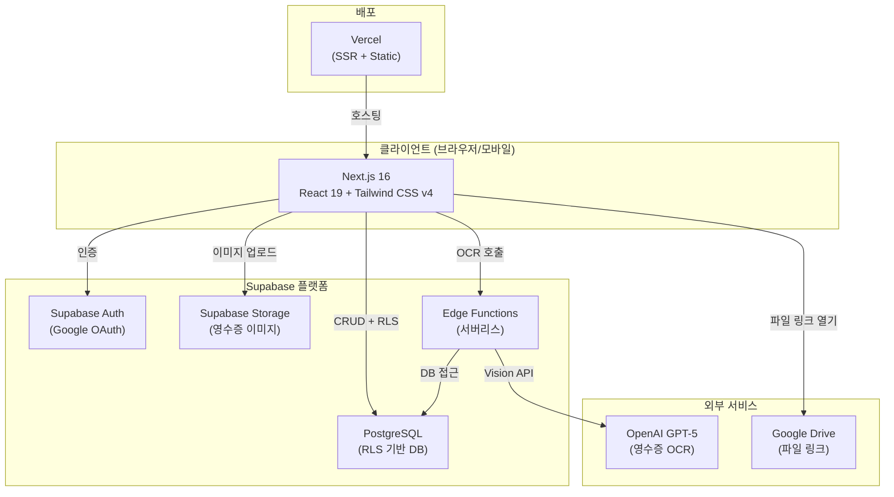

# 💰 중랑구청 자기주도 개인예산 관리 앱 — 구현 계획서

> **최종 업데이트**: 2026-03-19 10:20 | **전체 진행률**: Epic 1 (일부 완료) | 개발 초기 단계

---

## 1. 프로젝트 개요

**중랑구청**의 성인 발달장애인 당사자를 대상으로 **자기주도적 개인예산 관리**를 지원하는 **반응형 웹 애플리케이션**.
당사자가 예산 현황을 직관적으로 확인하고, 선택지를 비교하며, 영수증을 제출하는 과정을 통해 자기결정권을 보장합니다.
지원자는 계획 입력, 사용 내역 관리, 평가 작성, AI 분석 확인을 수행합니다.

### 핵심 가치
- **자기결정 중심**: 관리받는 구조가 아닌 스스로 선택하는 구조
- **직관적 시각화**: 복잡한 그래프보다 이미지와 크기 변화 중심 표현
- **성인 존중**: 유아적 표현 지양, 성인 친화적 디자인
- **보편적 이해**: 숫자가 어려워도 이해 가능한 정보 구조

---

## 2. 기술 스택

| 영역 | 기술 |
|------|------|
| **프론트엔드** | Next.js 16 + React 19 + TypeScript |
| **스타일링** | Tailwind CSS v4 (반응형, 접근성 최적화) |
| **언어** | TypeScript (전체) |
| **인증** | Supabase Auth (Google 로그인, `@nowondaycare.org` 도메인 제한) |
| **데이터베이스** | Supabase PostgreSQL (RLS 기반 권한 제어) |
| **스토리지** | Supabase Storage (영수증 이미지) |
| **AI/OCR** | OpenAI GPT-5 (영수증 OCR, 비용 검증 PoC 선행) |
| **파일 연동** | Google Drive 링크 첨부 |
| **배포** | Vercel (예정) |

---

## 3. 시스템 아키텍처



### 데이터 흐름 요약

| 흐름 | 경로 |
|------|------|
| **인증** | 브라우저 → Supabase Auth (Google OAuth) → `profiles` 테이블 |
| **예산 조회** | 브라우저 → PostgreSQL `participants` + `funding_sources` (RLS 필터) |
| **사용 내역 등록** | 지원자 → `transactions` 테이블 (status: pending → confirmed) |
| **영수증 OCR** | 당사자 업로드 → Supabase Storage → Edge Function → OpenAI → 임시 반영 |
| **평가/분석** | 지원자 작성 → `evaluations` 테이블 → AI 분석 → 당사자용 쉬운 설명 |
| **파일 링크** | 지원자 등록 → `file_links` 테이블 → 당사자 열람 |

---

## 4. 사용자 역할 및 권한

### 4.1 관리자

- 전체 당사자 정보 조회 및 관리
- 예산 구조 설정 (월/연 예산, 재원 수, 경고 기준)
- 계정 및 역할 관리
- 시스템 설정 변경

### 4.2 지원자

- 담당 당사자 예산 등록·수정
- 계획 등록·수정
- 사용 내역 CRUD
- 영수증 OCR 검토·확정
- 월별 평가 작성 (PCP 4+1 형식)
- 첨부파일 링크 등록
- AI 분석 확인
- 활동/선택지 제안 작성

### 4.3 당사자

- 본인 예산 현황 보기 (잔액 시각화)
- 선택지 미리보기 및 비교
- 영수증 사진 업로드 (임시 반영)
- 계획·평가의 쉬운 설명 보기
- 본인 파일 링크 열람

---

## 5. 데이터베이스 설계

### 5.1 테이블 구조

```
PostgreSQL (Supabase)
├── profiles                          ← 사용자 프로필
│   └── id: UUID (PK, auth.users FK)
│       ├── role: TEXT                (admin | supporter | participant)
│       ├── name: TEXT
│       └── created_at: TIMESTAMPTZ
│
├── participants                      ← 당사자 예산 프로필
│   └── id: UUID (PK, profiles FK)
│       ├── monthly_budget_default: NUMERIC  (기본 월 예산, 150,000)
│       ├── yearly_budget_default: NUMERIC   (기본 연 예산, 1,500,000)
│       ├── budget_start_date: DATE          (예산 시작일)
│       ├── budget_end_date: DATE            (예산 종료일)
│       ├── funding_source_count: INTEGER    (재원 수)
│       ├── alert_threshold: NUMERIC         (경고 기준 금액)
│       ├── assigned_supporter_id: UUID      (담당 지원자 FK)
│       └── created_at: TIMESTAMPTZ
│
├── funding_sources                   ← 재원별 예산
│   └── id: UUID (PK)
│       ├── participant_id: UUID     (participants FK)
│       ├── name: TEXT               (재원명)
│       ├── monthly_budget: NUMERIC  (월 예산)
│       ├── yearly_budget: NUMERIC   (연 예산)
│       ├── current_month_balance: NUMERIC  (이번 달 잔액)
│       ├── current_year_balance: NUMERIC   (올해 잔액)
│       └── created_at: TIMESTAMPTZ
│
├── transactions                      ← 사용 내역
│   └── id: UUID (PK)
│       ├── participant_id: UUID     (participants FK)
│       ├── funding_source_id: UUID  (funding_sources FK)
│       ├── date: DATE               (사용 날짜)
│       ├── activity_name: TEXT      (활동 내용)
│       ├── amount: NUMERIC          (사용 금액)
│       ├── category: TEXT           (분류)
│       ├── memo: TEXT               (메모)
│       ├── payment_method: TEXT     (결제 수단)
│       ├── receipt_image_url: TEXT   (영수증 이미지 URL)
│       ├── status: TEXT             (pending | confirmed)
│       ├── creator_id: UUID         (입력자 FK)
│       ├── created_at: TIMESTAMPTZ
│       └── updated_at: TIMESTAMPTZ
│
├── plans                             ← 계획 (미구현)
│   └── id: UUID (PK)
│       ├── participant_id: UUID
│       ├── date: DATE
│       ├── activity_name: TEXT
│       ├── options: JSONB           (선택지 배열: [{method, cost, time, description}])
│       ├── selected_option: INTEGER
│       ├── creator_id: UUID
│       ├── created_at: TIMESTAMPTZ
│       └── updated_at: TIMESTAMPTZ
│
├── evaluations                       ← 월별 평가 (미구현)
│   └── id: UUID (PK)
│       ├── participant_id: UUID
│       ├── month: DATE              (평가 대상 월)
│       ├── supporter_note: TEXT     (지원자 평가 내용, PCP 4+1)
│       ├── ai_analysis: JSONB      (AI 분석 결과)
│       ├── easy_summary: TEXT       (당사자용 쉬운 설명)
│       ├── creator_id: UUID
│       └── created_at: TIMESTAMPTZ
│
├── file_links                        ← 첨부파일 링크 (미구현)
│   └── id: UUID (PK)
│       ├── participant_id: UUID
│       ├── title: TEXT              (파일 제목)
│       ├── url: TEXT                (Google Drive URL)
│       ├── file_type: TEXT          (계획서 | 평가서 | 참고자료 | 기타)
│       ├── creator_id: UUID
│       └── created_at: TIMESTAMPTZ
│
└── activity_suggestions              ← 활동 제안 (미구현)
    └── id: UUID (PK)
        ├── participant_id: UUID
        ├── activity_name: TEXT
        ├── options: JSONB           (방법별 비용/시간/설명)
        ├── source: TEXT             (manual | ai)
        ├── creator_id: UUID
        └── created_at: TIMESTAMPTZ
```

### 5.2 RLS(Row Level Security) 정책

| 테이블 | 정책 |
|--------|------|
| `profiles` | 모든 인증 사용자 조회 가능, 본인만 수정 |
| `participants` | 당사자는 본인만 조회, 지원자/관리자는 전체 조회 |
| `funding_sources` | `participant_id` 기반 당사자 본인 조회, 지원자/관리자 전체 조회 |
| `transactions` | 당사자 본인 조회 + INSERT, 지원자/관리자 전체 CRUD |
| `plans` | 당사자 본인 조회, 지원자/관리자 전체 CRUD |
| `evaluations` | 당사자 본인 조회, 지원자/관리자 전체 CRUD |
| `file_links` | 당사자 본인 조회, 지원자/관리자 전체 CRUD |

### 5.3 주요 설계 결정사항

| 결정 | 이유 |
|------|------|
| 재원별 `current_month_balance` / `current_year_balance` 캐시 | 잔액 조회 시 매번 transactions 합산 불필요 |
| `transactions.status` (pending/confirmed) 분리 | 당사자 영수증 업로드 → 임시 반영 → 지원자 확정 흐름 |
| `plans.options`를 JSONB로 저장 | 방법 수가 유동적 (2~3개), 스키마 변경 없이 유연 |
| Google OAuth 도메인 제한 (`@nowondaycare.org`) | MVP 단계 보안 강화, 이후 일반 Gmail 허용 검토 |

---

## 6. 화면 구성

### 6.1 공통
- Google 로그인 화면 (도메인 제한 안내 포함)
- Auth 콜백 처리

### 6.2 당사자 화면 (모바일 최적화)
- **홈 대시보드**: 이번 달/올해 잔액 시각화, 통합/재원별 보기, 돈주머니 이미지 변화, 사용 속도 안내 ✅ (기본 구현 완료)
- **오늘 계획**: 활동 선택지 2~3개 비교 카드, 비용/시간/남는 예산 비교
- **영수증 올리기**: 촬영/업로드 → OCR → 임시 반영 → 지원자 확인
- **달력**: 월간 달력, 날짜별 사용 내역, 임시/확정 구분
- **더보기**: 기록 보기, 평가 보기, 파일 보기, 설정

### 6.3 지원자 화면 (반응형, PC 중심)
- **대시보드**: 담당 당사자 요약 + 메뉴 ✅ (기본 구현 완료)
- **당사자 관리**: 당사자 목록, 예산 설정, 재원 설정
- **사용 내역 관리**: 등록/조회/수정/삭제, 영수증 OCR 검토·확정
- **계획 관리**: 오늘 계획 비교 카드 작성
- **평가 관리**: PCP 4+1 형식 월별 평가, AI 분석
- **파일 관리**: Google Drive 링크 등록

### 6.4 관리자 화면 (반응형)
- **계정 관리**: 사용자 목록, 역할 변경
- **당사자 관리**: 전체 당사자 목록, 예산 구조 설정
- **시스템 설정**: 기관 기본 정보, 공통 문구 관리

### 6.5 하단 탭바 (당사자/모바일)
- 홈 | 오늘 계획 | 영수증 | 달력 | 더보기 ✅ (구현 완료)

---

## 7. 핵심 기능 상세

### 7.1 잔액 시각화 (1% 단위)

```
[홈 대시보드]
이번 달 잔액 → 큰 숫자 표시
  → 150,000원 기준 100단계 (1단계 = 1,500원)
  → 상태별 문구:
     81~100%: 예산이 넉넉합니다
     61~80%: 예산이 안정적입니다
     41~60%: 예산을 살펴보며 쓰고 있습니다
     21~40%: 남은 돈이 줄고 있습니다
     11~20%: 남은 돈이 적습니다
     0~10%: 모든 예산을 사용했습니다
  → 남은 날짜 대비 속도 안내
  → 돈주머니/지갑 이미지 변화
  → 올해 전체 잔액 보조 표시
```

✅ **현재 상태**: `budget-visuals.ts`에 시각화 로직 구현 완료, `page.tsx`에 잔액 카드 UI 구현 완료

### 7.2 오늘 계획 비교

```
활동명 선택 (입력 또는 추천)
  → 방법 카드 2~3개 표시
     각 카드: 예상 비용 / 예상 시간 / 선택 후 남는 예산 / 이미지 차이
  → 쉬운 설명 문구 표시
  → 미리보기 중심 (즉시 차감 안 됨)
  → 지원자가 실제 기록으로 전환 가능
```

### 7.3 영수증 OCR

```
당사자 또는 지원자 → 영수증 사진 촬영/업로드
  → Supabase Storage에 이미지 저장
  → Edge Function → OpenAI GPT-5 OCR
     → 날짜, 금액, 사용처 추출
  → 임시 반영 상태로 transactions에 저장 (status: pending)
  → 지원자 검토 화면:
     → 결과 확인 / 수정 / 확정
     → 확정 시 status: confirmed → 잔액 차감
```

### 7.4 월별 평가 및 AI 분석

```
지원자 → PCP 4+1 형식 평가 작성
  → AI 분석 생성 (OpenAI):
     [지원자용] 사용 흐름, 패턴, 위험 구간, 다음 지원 참고 포인트
     [당사자용] 쉬운 설명 카드 (간단한 문장, 어려운 용어 제외)
  → 관련 파일 링크 연결
```

### 7.5 달력형 사용 내역

```
월간 달력 표시
  → 사용 내역 있는 날 표시
  → 날짜 클릭 → 상세 내역 (임시/확정 구분)
  → 하루 총 사용액 표시
  → 재원별 사용 구분 표시
```

---

## 8. API 명세

### 8.1 Supabase Edge Functions (예정)

| 함수명 | 용도 | 입력 | 출력 |
|--------|------|------|------|
| `ocr-receipt` | 영수증 OCR | `{ imageUrl, mimeType }` | `{ date, amount, storeName, raw }` |
| `ai-analysis` | 월별 AI 분석 | `{ participantId, month }` | `{ supporterAnalysis, easySummary }` |
| `ai-suggestion` | 활동 제안 | `{ participantId }` | `{ suggestions: [] }` |

### 8.2 Next.js API Routes (예정)

| 경로 | 메서드 | 용도 |
|------|--------|------|
| `/api/auth/callback` | GET | Google OAuth 콜백 ✅ |
| `/api/transactions` | POST | 사용 내역 등록 (영수증 OCR 포함) |
| `/api/transactions/[id]/confirm` | PATCH | 영수증 확정 처리 |
| `/api/plans` | POST | 오늘 계획 등록 |
| `/api/evaluations` | POST | 월별 평가 등록 |

---

## 9. 보안 규칙

### PostgreSQL RLS 핵심 원칙

```
1. 관리자: 모든 테이블 읽기/쓰기
2. 지원자: 담당 당사자 데이터 및 전체 당사자 읽기/쓰기
3. 당사자: 본인 데이터 읽기, 영수증 제출(INSERT)만 가능
4. Google OAuth 도메인 제한: @nowondaycare.org만 허용
5. 영수증 임시 반영 데이터와 확정 데이터 구분
```

✅ **현재 상태**: `schema.sql`에 4개 테이블 RLS 정책 구현 완료

---

## 10. 접근성 및 호환성

| 항목 | 기준 |
|------|------|
| 지원 브라우저 | Chrome 90+, Safari 15+ (iOS), Edge 90+ |
| 모바일 | 큰 터치 영역, 모바일 우선 설계 |
| 접근성 | 큰 글씨 모드, 높은 대비 모드, 텍스트+아이콘+이미지 동시 제공 |
| 시각 원칙 | 한 화면에 한 가지 핵심 판단, 성인 친화적 일러스트 |
| 디자인 | 차분한 파랑 + 초록(긍정) + 주황(주의) + 빨강(위험) |

---

## 11. 프로젝트 디렉토리 구조

```
Personal_Budgets_App/
├── public/
│   └── favicon.ico
├── src/
│   ├── app/                          ← Next.js App Router
│   │   ├── layout.tsx               ← 루트 레이아웃 (TabBar 포함) ✅
│   │   ├── page.tsx                 ← 홈 대시보드 (잔액 시각화) ✅
│   │   ├── globals.css              ← Tailwind CSS 전역 스타일 ✅
│   │   ├── login/
│   │   │   └── page.tsx             ← Google 로그인 페이지 ✅
│   │   └── auth/
│   │       └── callback/            ← OAuth 콜백 ✅
│   │           └── route.ts
│   ├── components/
│   │   └── layout/
│   │       └── TabBar.tsx           ← 하단 탭 네비게이션 ✅
│   ├── hooks/
│   │   └── useAuth.ts              ← 인증 훅 ✅
│   ├── lib/                         ← (비어있음, 향후 유틸/서비스)
│   ├── types/                       ← (비어있음, 향후 타입 정의)
│   ├── utils/
│   │   ├── budget-visuals.ts        ← 예산 시각화 유틸리티 ✅
│   │   └── supabase/
│   │       ├── client.ts            ← Supabase 클라이언트 ✅
│   │       ├── server.ts            ← Supabase 서버 클라이언트 ✅
│   │       ├── schema.sql           ← DB 스키마 (4 테이블) ✅
│   │       └── schema_memo.sql      ← 스키마 메모 ✅
│   └── middleware.ts                ← 인증 미들웨어 ✅
├── Plan&Source/
│   ├── 중랑구청자기주도개인예산관리앱_v3_20260312.md  ← 요구사항 원본
│   ├── 차량운행일지_구현계획서.md                         ← 참고 양식
│   ├── 개인예산관리앱_구현계획서.md                       ← 이 문서
│   └── vibe-coding-context-template.md                   ← 바이브코딩 템플릿
├── .env.local                        ← 환경변수 ✅
├── package.json
├── tsconfig.json
├── next.config.ts
├── eslint.config.mjs
└── postcss.config.mjs
```

---

## 12. 환경 변수

### `.env.local`

| 키 | 용도 | 상태 |
|----|------|------|
| `NEXT_PUBLIC_SUPABASE_URL` | Supabase 프로젝트 URL | ✅ 설정 완료 |
| `NEXT_PUBLIC_SUPABASE_ANON_KEY` | Supabase 익명 키 | ✅ 설정 완료 |
| `OPENAI_API_KEY` | OpenAI GPT-5 API (OCR) | ⏳ 미설정 |

---

## 13. 구현 이력 (Epic별)

### Epic 1: 프로젝트 설정 및 인증 🏗️ (진행 중)

| 항목 | 내용 | 상태 |
|------|------|------|
| Next.js 16 프로젝트 생성 | `Personal_Budgets_App` | ✅ |
| Tailwind CSS v4 설정 | PostCSS 연동 | ✅ |
| Supabase 프로젝트 연결 | `.env.local`, `client.ts`, `server.ts` | ✅ |
| Google 로그인 구현 | `login/page.tsx`, `auth/callback/route.ts` | ✅ |
| 도메인 제한 (`@nowondaycare.org`) | 미들웨어에서 처리 | ⚠️ 확인 필요 |
| 인증 미들웨어 | `middleware.ts` — 비인증 사용자 리다이렉트 | ✅ |
| 인증 훅 | `useAuth.ts` — 세션 감시 | ✅ |
| 역할 기반 라우팅 | `page.tsx` — 당사자/지원자/관리자 분기 | ✅ (기본) |
| DB 스키마 | 4개 테이블 (profiles, participants, funding_sources, transactions) | ✅ |
| RLS 정책 | 역할별 접근 제어 | ✅ |
| 하단 탭바 | `TabBar.tsx` — 5개 탭 | ✅ |
| 홈 대시보드 | 잔액 시각화 + 빠른 실행 버튼 | ✅ |
| 예산 시각화 유틸 | `budget-visuals.ts` — 상태/문구/아이콘 결정 | ✅ |
| Supabase에 실제 DB 적용 | SQL 스키마 실행 + 테스트 데이터 | ⏳ 미완료 |
| 프로필 자동 생성 트리거 | Google 로그인 시 profiles 자동 INSERT | ⏳ 미완료 |

### Epic 2: 사용자 및 권한 구조 ⏳ (미시작)

| 항목 | 내용 | 상태 |
|------|------|------|
| 당사자 목록 화면 | 지원자/관리자용 | ⏳ |
| 당사자 등록/수정 폼 | 이름, 예산 정보, 재원 설정 | ⏳ |
| 담당 지원자 지정 | 드롭다운 선택 | ⏳ |
| 권한별 메뉴 노출 | TabBar + 더보기 메뉴 차별화 | ⏳ |

### Epic 3: 예산 구조 및 시각화 ⏳ (미시작)

| 항목 | 내용 | 상태 |
|------|------|------|
| 통합/재원별 보기 전환 | 토글 UI | ⏳ |
| 돈주머니 이미지 변화 | 잔액 비율별 이미지 | ⏳ |
| 남은 날짜 반영 속도 문구 | 예산 소비 속도 분석 | ✅ (기본 로직) |

### Epic 4: 오늘 계획 비교 ⏳ (미시작)

| 항목 | 내용 | 상태 |
|------|------|------|
| 활동 입력 UI | 활동명 + 방법 카드 | ⏳ |
| 선택지 비교 카드 | 비용/시간/잔액/이미지 비교 | ⏳ |
| 미리보기 중심 로직 | 즉시 차감 안 됨 | ⏳ |

### Epic 5: 사용 내역 관리 ⏳ (미시작)

| 항목 | 내용 | 상태 |
|------|------|------|
| 내역 CRUD | 목록/등록/수정/삭제 | ⏳ |
| 필터/검색 | 기간, 분류, 재원 필터 | ⏳ |
| 재원 구분 처리 | 재원별 잔액 자동 계산 | ⏳ |

### Epic 6: 영수증 OCR ⏳ (미시작)

| 항목 | 내용 | 상태 |
|------|------|------|
| 업로드 UI | 카메라/갤러리 선택 | ⏳ |
| OpenAI OCR 연동 | Edge Function | ⏳ |
| 임시 반영 → 확정 흐름 | status 관리 | ⏳ |

### Epic 7: 달력 및 평가 ⏳ (미시작)

| 항목 | 내용 | 상태 |
|------|------|------|
| 달력 화면 | 월간 달력 + 날짜별 사용 | ⏳ |
| 4+1 평가 입력 | PCP 형식 | ⏳ |
| AI 분석 + 쉬운 설명 | OpenAI 연동 | ⏳ |

### Epic 8: 파일 링크 및 추천 ⏳ (미시작)

| 항목 | 내용 | 상태 |
|------|------|------|
| Google Drive 링크 첨부 | URL 등록 UI | ⏳ |
| 활동 제안 로직 | AI 기반 추천 | ⏳ |

### Epic 9: 접근성 및 검증 ⏳ (미시작)

| 항목 | 내용 | 상태 |
|------|------|------|
| 큰 글씨 모드 | 3단계 폰트 크기 | ⏳ |
| 높은 대비 모드 | 색상 대비 강화 | ⏳ |
| 상태 메시지 시스템 | 토스트/피드백 | ⏳ |

---

## 14. 검증 계획

### 14.1 Epic별 검증

| Epic | 검증 방법 |
|------|----------|
| Epic 1 | Google 로그인 → 역할별 화면 분기 확인, 도메인 제한 테스트 |
| Epic 2 | 당사자 등록 → 지원자 연결 → 권한별 메뉴 노출 확인 |
| Epic 3 | 잔액 시각화 → 통합/재원별 보기 전환 → 문구/이미지 변화 확인 |
| Epic 4 | 선택지 카드 → 비용/시간/잔액 비교 → 미리보기 정확성 확인 |
| Epic 5 | 사용 내역 CRUD → 잔액 자동 계산 → 재원별 구분 확인 |
| Epic 6 | 영수증 업로드 → OCR 추출 → 임시 반영 → 지원자 확정 → 잔액 변경 확인 |
| Epic 7 | 달력 날짜별 표시 → 평가 입력 → AI 분석 → 쉬운 설명 확인 |
| Epic 8 | 파일 링크 등록 → 당사자 열람 확인 |
| Epic 9 | 큰 글씨/높은 대비 모드 → 모바일 실기기 테스트 |

### 14.2 검증 방법

- `npm run dev` 실행 후 브라우저에서 직접 테스트
- Supabase Dashboard에서 데이터 확인
- 모바일 DevTools + 실기기 테스트
- RLS 정책 테스트 (역할별 쿼리 결과 비교)

---

## 15. 다음 단계 (즉시 착수 가능한 작업)

### 우선순위 1: Epic 1 미완료 항목
1. Supabase에 `schema.sql` 실행하여 실제 DB 적용
2. Google 로그인 시 `profiles` 테이블 자동 INSERT 트리거 설정
3. `@nowondaycare.org` 도메인 제한 로직 확인 및 강화
4. 테스트 데이터 (당사자 1명 + 재원 2개) 입력

### 우선순위 2: Epic 2 (사용자 및 권한 구조)
1. 관리자 → 당사자 등록/수정 화면
2. 지원자 → 담당 당사자 목록 화면
3. 권한별 메뉴 노출 제어 (TabBar, 더보기)

### 우선순위 3: Epic 5 (사용 내역 관리)
1. 지원자용 사용 내역 등록 폼
2. 당사자별 내역 목록/상세 조회
3. 잔액 자동 계산 로직

---

## 16. 차량운행일지 구현계획서와의 비교

| 차량운행일지 항목 | 개인예산관리앱 대응 | 적용 상태 |
|------------------|-------------------|----------|
| Firebase Auth (Google) | Supabase Auth (Google) | ✅ 적용 |
| Cloud Firestore | PostgreSQL (Supabase) | ✅ 적용 |
| 역할 기반 라우팅 | role 기반 화면 분기 | ✅ 적용 |
| Vite + React | Next.js 16 + React 19 | ✅ 적용 |
| TailwindCSS v3 | Tailwind CSS v4 | ✅ 적용 |
| Cloud Functions | Supabase Edge Functions | ⏳ 미구현 |
| Gemini OCR | OpenAI OCR | ⏳ 미구현 |
| FCM 푸시 알림 | 미정 (PWA Push 또는 생략) | ⏳ 미결정 |
| 실시간 구독 (onSnapshot) | Supabase Realtime | ⏳ 미구현 |
| Phase별 구현 이력 관리 | Epic별 구현 이력 관리 | ✅ 적용 |
| 에러 처리 계층 | 토스트/에러 바운더리 | ⏳ 미구현 |
| PDF/Excel 출력 | 미정 (우선순위 낮음) | ⏳ 미결정 |
| PWA 지원 | 미정 (향후 검토) | ⏳ 미결정 |
| 시퀀스 다이어그램 | Mermaid 아키텍처 다이어그램 | ✅ 적용 |
| API 명세 (Cloud Functions) | API 명세 (Edge Functions + API Routes) | ✅ 양식 적용 |
| 보안 규칙 (Firestore Rules) | RLS 정책 (PostgreSQL) | ✅ 적용 |
| 디렉토리 구조 문서화 | ✅ 적용 ✅ | ✅ 적용 |
